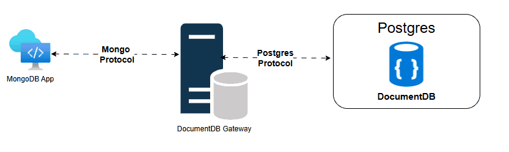

# DocumentDB Gateway


## Overview

The DocumentDB Gateway acts as a protocol translation layer between MongoDB clients and a PostgreSQL backend. It interprets MongoDB wire protocol, maps commands to PostgreSQL operations, and manages session handling, transactions, cursor-based paging, and TLS termination.


---

## MongoDB Request Translation

The gateway converts MongoDB operations into PostgreSQL equivalents.  
Example: `insertMany` → PostgreSQL `BATCH INSERT`.

---

## Authentication & Session Management

- Supports SCRAM authentication.
- Authenticates against PostgreSQL credentials.
- Translates SCRAM flows to Postgres operations.
- Maintains sessions per user to enforce scoped permissions.

---

## User Management

- MongoDB commands like `createUser`, `updateUser`, `dropUser` are mapped to PostgreSQL.
- Roles supported: `readAnyDatabase`, `readWriteAnyDatabase`.
- PostgreSQL enforces access policies.

---

## Transactions

- Transactions tied to sessions via `transaction_number`.
- Managed through a `TransactionStore`:
  - Tracks states: `Started`, `Committed`, `Aborted`.
  - Prevents duplicates/conflicts.
- Uses PostgreSQL's `BEGIN`, `COMMIT`, `ROLLBACK`.
- Includes auto-cleanup for expired transactions.

---

## Paging & Cursors

- Mongo-style cursor paging → PostgreSQL `LIMIT/OFFSET`.
- Returns `cursorId` and first result batch.
- `getMore` fetches subsequent pages.
- `CursorStore` manages cursor lifecycle and cleanup.

---

## Pluggable Telemetry

- Supports custom telemetry backends via trait implementation.
- Logging, metrics, tracing supported.
- OpenTelemetry plugin support planned.

---

## Load Balancing & Failover *(Planned)*

- Planned read scaling via replica distribution.
- Writes routed to primary.
- Failover handling through:
  - Primary detection
  - Reconnect logic
  - Transaction recovery via `RecoveryToken`


## Getting started with DocumentDB Gateway

To get started with the DocumentDB Gateway, follow these steps:
        
1. **Build the Gateway**: Build the DocumentDB Gateway using the provided Dockerfile.
    ```bash
    docker build . -f .github/containers/Build-Ubuntu/Dockerfile_gateway -t <image-tag>
    ```
2. **Run the Gateway**: Run the DocumentDB Gateway in a Docker container.
    ```bash
    docker run -dt -p 10260:10260 -e USERNAME=<username> -e PASSWORD=<password> <image-tag>
    ```
3. **Connect to the Gateway**: Use Mongosh to connect to the DocumentDB Gateway.
    ```bash
    mongosh localhost:10260 -u <username> -p <password> \
        --authenticationMechanism SCRAM-SHA-256 \
        --tls \
        --tlsAllowInvalidCertificates
    ```