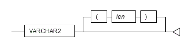
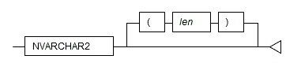
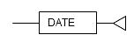

Chapter 3 Data Types
---

The following data types are supported:

 - VARCHAR2
 - NVARCHAR2
 - DATE

### 3.1 VARCHAR2

**Syntax**

Specify the VARCHAR2 type as follows.

|Data type syntax|Explanation|
|:---|:---|
|VARCHAR2(*len*)|String with a variable length up to *len* characters   For *len*, specify an integer greater than 0.   If *len* is omitted, the string can be any length.|

**General rules**

 - VARCHAR2 is a character data type. Specify the number of bytes for the length.
 - Strings are of variable length. The specified value will be stored as is. The upper limit for this data type is approximately one gigabyte.

**Note**

----

The VARCHAR2 type does not support collating sequences. Therefore, the following error occurs when a collating sequence like that of an ORDER BY clause is required. 
At this time, the following HINT will prompt to use a COLLATE clause, however, because collating sequences are not supported, it is not possible to use this clause.

~~~
ERROR:   could not determine which collation to use for string comparison
HINT:   Use the COLLATE clause to set the collation explicitly.
~~~

If the error shown above is displayed, explicitly cast the column to VARCHAR or TEXT type.

----

### 3.2 NVARCHAR2

**Syntax**

Specify the NVARCHAR2 type as follows.

|Data type syntax|Explanation|
|:---|:---|
|NVARCHAR2(*len*)| National character string with a variable length up to *len* characters.   For *len*, specify an integer greater than 0.   If *len* is omitted, the string can be any length.|

**General rules**

 - NVARCHAR2 is a national character data type. Specify the number of characters for the length.
 - Strings are of variable length. The specified value will be stored as is. The upper limit for this data type is approximately one gigabyte.

**Note**

----

The NVARCHAR2 type does not support collating sequences. Therefore, the following error occurs when a collating sequence like that of an ORDER BY clause is required. At this time, the following HINT will prompt to use a COLLATE clause, however, because collating sequences are not supported, it is not possible to use this clause.

~~~
ERROR:   could not determine which collation to use for string comparison
HINT:   Use the COLLATE clause to set the collation explicitly.
~~~

If the error shown above is displayed, explicitly cast the column to NCHAR VARYING or TEXT type.

----

### 3.3 DATE

**Syntax**

Specify the DATE type as follows.

|Data type syntax|Explanation|
|:---|:---|
|DATE|Stores date and time|

**General rules**

 - DATE is a date/time data type.
 - Date and time are stored in DATE. The time zone is not stored.

**Note**

----

If the DATE type of orafce is used in DDL statements such as table definitions, always set search_path before executing a DDL statement. Even if search_path is changed after definition, the data type will be the DATE type of PostgreSQL.

----

**Information**

----

The DATE type of orafce is equivalent to the TIMESTAMP type of PostgreSQL. Therefore, of the existing functions of PostgreSQL, functions for which the data type of the argument is TIMESTAMP can be used.

----

