Chapter 5 SQL Function Reference
---

### 5.1 Mathematical Functions

The following mathematical functions are supported:

 - BITAND
 - COSH
 - SINH
 - TANH

#### 5.1.1 BITAND

**Description**

Performs a bitwise AND operation.

**Syntax**

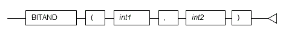 


**General rules**

 - BITAND performs an AND operation on each bit of two integers, and returns the result.
 - Specify integer type values. 
 - The data type of the return value is BIGINT.


**Example**

----

In the following example, the result of the AND operation on numeric literals 5 and 3 is returned.

~~~
SELECT BITAND(5,3) FROM DUAL;
 bitand
-------
      1
(1 row)
~~~

----


#### 5.1.2 COSH

**Description**

Calculates the hyperbolic cosine of a number.

**Syntax**

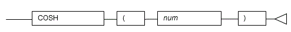 


**General rules**

 - COSH returns the hyperbolic cosine of the specified number.
 - The number must be a numeric data type.
 - The data type of the return value is DOUBLE PRECISION.

**Example**

----

In the following example, the hyperbolic cosine of the numeric literal 2.236 is returned.

~~~
SELECT COSH(2.236) FROM DUAL;
      cosh
-----------------
4.7313591000247
(1 row)
~~~

----


#### 5.1.3 SINH

**Description**

Calculates the hyperbolic sine of a number.

**Syntax**

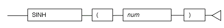 


**General rules**

 - SINH returns the hyperbolic sine of the specified number.
 - The number must be a numeric data type. 
 - The data type of the return value is DOUBLE PRECISION.

**Example**

----

In the following example, the hyperbolic sine of the numeric literal 1.414 is returned.

~~~
SELECT SINH(1.414) FROM DUAL;
      sinh
-----------------
1.93460168824956
(1 row)
~~~

----


#### 5.1.4 TANH

**Description**

Calculates the hyperbolic tangent of a number.

**Syntax**

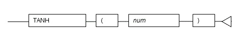 

**General rules**

 - TANH returns the hyperbolic tangent of the specified number.
 - The number must be a numeric data type. 
 - The data type of the return value is DOUBLE PRECISION.

**Example**

----

In the following example, the hyperbolic tangent of the numeric literal 3 is returned.

~~~
SELECT TANH(3) FROM DUAL;
      tanh
-----------------
0.995054753686731
(1 row)
~~~

----

### 5.2 String Functions

The following string functions are supported:

 - BTRIM
 - INSTR
 - LENGTH
 - LENGTHB
 - LPAD
 - LTRIM
 - NLSSORT
 - REGEXP_COUNT
 - REGEXP_INSTR
 - REGEXP_LIKE
 - REGEXP_SUBSTR
 - RPAD
 - RTRIM
 - SUBSTR
 - SUBSTRB

#### 5.2.1 BTRIM

**Description**

Removes the specified characters from the beginning and end of a string.

**Syntax**

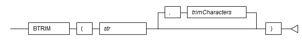 

**General rules**

 - BTRIM returns a string with *trimChars* removed from the beginning and end of string *str*.
 - If multiple trim characters are specified, all characters matching the trim characters are removed. If *trimChars* is omitted, all leading and trailing halfwidth spaces are removed.
 - The data type of the return value is TEXT.

**Note**

----

 - BTRIM does not exist for Oracle databases.
 - The CHAR type specification for BTRIM uses orafce for its behavior, which is different to that of BTRIM of PostgreSQL. The search_path parameter must be modified for it to behave the same as the specification described above.

----


**Information**

----

The general rule for BTRIM of PostgreSQL is as follows:

 - If the string is CHAR type, trailing spaces are removed and then the trim characters are removed.

----


**See**

----

 - Refer to "Notes on Using orafce" for information on how to edit search_path.
 - Refer to "The SQL Language" > "Functions and Operators" > "String Functions and Operators" in the PostgreSQL Documentation for information on BTRIM.

----


**Example**

----

In the following example, a string that has had "a" removed from both ends of "aabcaba" is returned.

~~~
SELECT BTRIM('aabcaba','a') FROM DUAL;
 btrim
-------
 bcab
(1 row)
~~~

----

#### 5.2.2 INSTR

**Description**

Returns the position of a substring in a string.

**Syntax**

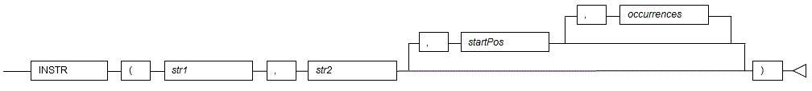 


**General rules**

 - INSTR searches for substring *str2* in string *str1* and returns the position (in characters) in *str1* of the first character of the occurrence.
 - The search starts from the specified start position *startPos* in *str1*.
 - When *startPos* is 0 or negative, the start position will be the specified number of characters from the left of the end of *str1*, and INSTR will search backward from that point.
 - If the start position is not specified, the search will be performed from the beginning of *str1*.
 - If *occurrences* is specified, the position in *str1* of the nth occurrence of *str2* is returned. Only positive numbers can be specified.
 - If *occurrences* is not specified, the start position of the first occurrence that is found is returned.
 - If *str2* is not found in *str1*, 0 is returned.
 - For *startPos* and *occurrences*, specify a SMALLINT or INTEGER type. 
 - The data type of the return value is INTEGER.

**Example**

----

In the following example, characters "BC" are found in string "ABCACBCAAC", and the position of those characters is returned.

~~~
SELECT INSTR('ABCACBCAAC','BC') FROM DUAL;
 instr
-------
     2
(1 row)

SELECT INSTR('ABCACBCAAC','BC',-1,2) FROM DUAL;
 instr
-------
     2
(1 row)
~~~

----

#### 5.2.3 LENGTH

**Description**

Returns the length of a string in number of characters.


**Syntax**

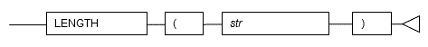 


**General rules**

 - LENGTH returns the number of characters in string *str*.
 - If the string is CHAR type, trailing spaces are included in the length.
 - The data type of the return value is INTEGER.

**Note**

----

The LENGTH specification above uses orafce for its behavior, which is different to that of LENGTH of PostgreSQL. The search_path parameter must be modified for it to behave according to the orafce specification.

----


**Information**

----

The general rule for LENGTH of PostgreSQL is as follows:

 - If the string is CHAR type, trailing spaces are not included in the length.

----


**See**

----

 - Refer to "Notes on Using orafce" for information on how to edit search_path.
 - Refer to "The SQL Language" > "Functions and Operators" > "String Functions and Operators" in the PostgreSQL Documentation for information on LENGTH.

----


**Example**

----

In the following example, the number of characters in column col2 (defined using CHAR(10)) in table t1 is returned.

~~~
SELECT col2,LENGTH(col2) FROM t1 WHERE col1 = '1001';
    col2    | length
------------+--------
 AAAAA      |     10
(1 row)
~~~

----

#### 5.2.4 LENGTHB

**Description**

Returns the length of a string in number of bytes.

**Syntax**

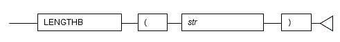 


**General rules**

 - LENGTHB returns the number of bytes in string *str*.
 - If the string is CHAR type, trailing spaces are included in the length.
 - The data type of the return value is INTEGER.

**Example**
 
----

In the following example, the number of bytes in column col2 (defined using CHAR(10)) in table t1 is returned.
Note that, in the second SELECT statement, each character in "\*" has a length of 3 bytes, for a total of 9 bytes, and 7 bytes are added for the 7 trailing spaces. This gives a result of 16 bytes.

~~~
SELECT col2,LENGTHB(col2) FROM t1 WHERE col1 = '1001';
     col2      | lengthb
---------------+---------
 AAAAA         |      10
(1 row)

SELECT col2,LENGTHB(col2) FROM t1 WHERE col1 = '1004';
     col2      | lengthb
---------------+---------
 ***           |      16
(1 row)
~~~

----


#### 5.2.5 LPAD

**Description**

Left-pads a string to a specified length with a sequence of characters.

**Syntax**

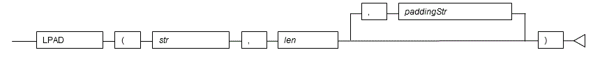 

**General rules**

 - LPAD returns the result after repeatedly padding the beginning of string *str* with padding characters *paddingStr* until the string reaches length *len*.
 - If the string is CHAR type, the padding characters are added to the string without removing trailing spaces. 
 - In the resultant string, fullwidth characters are recognized as having a length of 2, and halfwidth characters having a length of 1. If a fullwidth character cannot be included in the resultant string because there is only space available for one halfwidth character, the string is padded with a single-byte space.
 - The data type of the return value is TEXT.

**Note**

----

The LPAD specification above uses orafce for its behavior, which is different to that of LPAD of PostgreSQL. The search_path parameter must be modified for it to behave according to the orafce specification.

----


**Information**

----

The general rules for LPAD of PostgreSQL are as follows:

 - If the string is CHAR type, trailing spaces are removed and then the padding characters are added to the string.
 - The result length is the number of characters.

----


**See**

----

 - Refer to "Notes on Using orafce" for information on how to edit search_path.
 - Refer to "The SQL Language" > "Functions and Operators" > "String Functions and Operators" in the PostgreSQL Documentation for information on LPAD.

----

**Example**

----

In the following example, a 10-character string that has been formed by left-padding the string "abc" with "a" is returned.

~~~
SELECT LPAD('abc',10,'a') FROM DUAL;
    lpad
------------
 aaaaaaaabc
(1 row)
~~~

----


#### 5.2.6 LTRIM

**Description**

Removes the specified characters from the beginning of a string.

**Syntax**

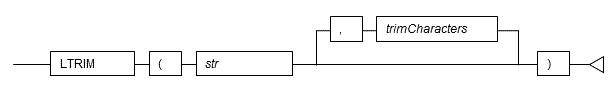 

**General rules**

 - LTRIM returns a string with *trimChars* removed from the beginning of string *str*.
 - If multiple trim characters are specified, all characters matching the trim characters are removed. If *trimChars* is omitted, all leading halfwidth spaces are removed.
 - The data type of the return value is TEXT.

**Note**

----

The LTRIM specification above uses orafce for its behavior, which is different to that of LTRIM of PostgreSQL. The search_path parameter must be modified for it to behave according to the orafce specification.

----


**Information**

----

The general rule for LTRIM of PostgreSQL is as follows:

 - If the string is CHAR type, trailing spaces are removed and then the trim characters are removed.

----

**See**

----

 - Refer to "Notes on Using orafce" for information on how to edit search_path.
 - Refer to "The SQL Language" > "Functions and Operators" > "String Functions and Operators" in the PostgreSQL Documentation for information on LTRIM.

----


**Example**

----

In the following example, a string that has had "ab" removed from the beginning of "aabcab" is returned.

~~~
SELECT LTRIM('aabcab','ab') FROM DUAL;
 ltrim
-------
 cab
(1 row)
~~~

----


#### 5.2.7 NLSSORT

**Description**

Returns a byte string that denotes the lexical order of the locale (COLLATE).

**Syntax**

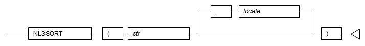 

**General rules**

 - NLSSORT is used for comparing and sorting in the collating sequence of a locale (COLLATE) that differs from the default locale.
 - Values that can be specified for the locale differ according to the operating system of the database server.
 - If the locale is omitted, it is necessary to use set_nls_sort to set the locale in advance. To set the locale using set_nls_sort, execute a SELECT statement.

**Example of setting set_nls_sort using a SELECT statement**

~~~
SELECT set_nls_sort('en_US.UTF8');
~~~

 - The data type of the return value is BYTEA.

**Note**

----

If specifying locale encoding, ensure it matches the database encoding.

----


**See**

----

Refer to "Server Administration" > "Localization" > "Locale Support" in the PostgreSQL Documentation for information on the locales that can be specified.

----

**Example**

----

[Composition of table (t3)]

|col1 | col2|
|:--- |:--- |
|1001 |aabcababc|
|2001 |abcdef|
|3001 |aacbaab|

In the following example, the result of sorting column col2 in table t3 by "da_DK.UTF8" is returned.

~~~
SELECT col1,col2 FROM t3 ORDER BY NLSSORT(col2,'da_DK.UTF8');
 col1 |    col2
------+------------
 2001 | abcdef
 1001 | aabcababc
 3001 | aacbaab
(3 row)
~~~

----

#### 5.2.8 REGEXP_COUNT

**Description**

Searches a string for a regular expression, and returns a count of the matches.

**General rules**

 - REGEXP_COUNT returns the number of times *pattern* occurs in a source *string*. It returns an integer indicating the number of occurrences of *pattern*. If no match is found, then the function returns 0.
 - The search starts from the specified start position *startPos* in *string*, default starts from the beginning of *string*.
 - *startPos* is a positive integer, negative values to search from the end of *string* are not allowed.
 - *flags* is a character expression that lets you change the default matching behavior of the function.
   The value of *flags* can include one or more of the following characters:
   - 'i': case-insensitive matching.
   - 'c': case-sensitive and accent-sensitive matching.
   - 'n': the period (.) match the newline character. By default the period does not match the newline character.
   - 'm': treats the source string as multiple lines.
   - 'x': ignores whitespace characters. By default, whitespace characters match themselves.
   If you omit *flags*, then:
   - The default is case and accent sensitivity.
   - A period (.) does not match the newline character.
   - The source string is treated as a single line.

**Example**

~~~
SELECT REGEXP_COUNT('a'||CHR(10)||'d', 'a.d') FROM DUAL;
 regexp_count 
--------------
            0
(1 row)

SELECT REGEXP_COUNT('a'||CHR(10)||'d', 'a.d', 1, 'm') FROM DUAL;
 regexp_count 
--------------
            0
(1 row)

SELECT REGEXP_COUNT('a'||CHR(10)||'d', 'a.d', 1, 'n') FROM DUAL;
 regexp_count 
--------------
            1
(1 row)

SELECT REGEXP_COUNT('a'||CHR(10)||'d', '^d$', 1, 'm') FROM DUAL;
 regexp_count 
--------------
            1
(1 row)
~~~

----

#### 5.2.9 REGEXP_INSTR

**Description**

Returns the beginning or ending position within the string where the match for a pattern was located.

**General rules**

 - REGEXP_INSTR returns an integer indicating the beginning or ending position of the matched substring, depending on the value of the *return_opt* argument. If no match is found, then the function returns 0. 
 - The search starts from the specified start position *startPos* in *string*, default starts from the beginning of *string*.
 - *startPos* is a positive integer, negative values to search from the end of *string* are not allowed.
 - *occurrence* is a positive integer indicating which occurrence of *pattern* in *string* should be search for. The default is 1, meaning the first occurrence of *pattern* in *string*.
 - *return_opt* lets you specify what should be returned in relation to the occurrence:
    - 0, the position of the first character of the occurrence is returned. This is the default.
    - 1, the position of the character following the occurrence is returned.
 - *flags* is a character expression that lets you change the default matching behavior of the function.  See [REGEXP_COUNT](#REGEXP_COUNT) for detailed information.
 - For a *pattern* with capture group, *group* is a positive integer indicating which capture group in *pattern* shall be returned by the function. Capture groups can be nested, they are numbered in order in which their left parentheses appear in *pattern*. If *group* is zero, then the position of the entire substring that matches the pattern is returned. If *group* value exceed the number of capture groups in *pattern*, the function returns zero. A null *group* value returns *NULL*. The default value for *group* is zero.

**Example**

~~~
SELECT REGEXP_INSTR('1234567890', '(123)(4(56)(78))') FROM DUAL;
 regexp_instr 
--------------
            1
(1 row)

SELECT REGEXP_INSTR('1234567890', '(4(56)(78))', 3) FROM DUAL;
 regexp_instr 
--------------
            4
(1 row)

SELECT REGEXP_INSTR('123 123456 1234567, 1234567 1234567 12', '[^ ]+', 1, 6) FROM DUAL;
 regexp_instr 
--------------
           37

(1 row)

SELECT REGEXP_INSTR('199 Oretax Prayers, Riffles Stream, CA', '[S|R|P][[:alpha:]]{6}', 3, 2, 1) FROM DUAL;
 regexp_instr 
--------------
           28
(1 row)
~~~

----

#### 5.2.10 REGEXP_LIKE

**Description**

Condition in the WHERE clause of a query, causing the query to return rows that match the given pattern.

**General rules**

 - REGEXP_LIKE is similar to the LIKE condition, except it performs regular expression matching instead of the simple pattern matching performed by LIKE.
 - Returns a boolean, *true* when *pattern* match in *string*, *false* otherwise.
 - *flags* is a character expression that lets you change the default matching behavior of the function. See [REGEXP_COUNT](#REGEXP_COUNT) for detailed information.

**Example**

~~~
SELECT REGEXP_LIKE('a'||CHR(10)||'d', 'a.d', 'm') FROM DUAL;
 regexp_like 
-------------
 f
(1 row)

SELECT REGEXP_LIKE('a'||CHR(10)||'d', 'a.d', 'n') FROM DUAL;
 regexp_like 
-------------
 t
(1 row)
~~~

----

#### 5.2.11 REGEXP_SUBSTR

**Description**

Returns the string that matches the pattern specified in the call to the function.

**General rules**

 - REGEXP_SUBSTR returns the matched substring resulting from matching a POSIX regular expression pattern to a string. If no match is found, then the function returns *NULL*. 
 - The search starts from the specified start position *startPos* in *string*, default starts from the beginning of *string*.
 - *startPos* is a positive integer, negative values to search from the end of *string* are not allowed.
 - *occurrence* is a positive integer indicating which occurrence of *pattern* in *string* should be search for. The default is 1, meaning the first occurrence of *pattern* in *string*.
 - *flags* is a character expression that lets you change the default matching behavior of the function.  See [REGEXP_COUNT](#REGEXP_COUNT) for detailed information.
 - For a *pattern* with capture group, *group* is a positive integer indicating which capture group in *pattern* shall be returned by the function. Capture groups can be nested, they are numbered in order in which their left parentheses appear in *pattern*. If *group* is zero, then the position of the entire substring that matches the pattern is returned. If *group* value exceed the number of capture groups in *pattern*, the function returns *NULL*. A null *group* value returns *NULL*. The default value for *group* is zero.

**Example**

~~~
SELECT REGEXP_SUBSTR('number of your street, zipcode town, FR', ',[^,]+') FROM DUAL;
 regexp_substr  
----------------
 , zipcode town
(1 row)

SELECT regexp_substr('number of your street, zipcode town, FR', ',[^,]+', 24) FROM DUAL;
 regexp_substr 
---------------
 , FR
(1 row)

SELECT regexp_substr('number of your street, zipcode town, FR', ',[^,]+', 1, 2) FROM DUAL;
 regexp_substr 
---------------
 , FR
(1 row)

SELECT regexp_substr('1234567890 1234567890', '(123)(4(56)(78))', 1, 1, 'i', 0) FROM DUAL;
 regexp_substr 
---------------
 12345678
(1 row)
~~~

----

#### 5.2.12 REGEXP_REPLACE

**Description**

Returns the string that matches the pattern specified in the call to the function.

**General rules**

 - REGEXP_REPLACE returns a modified version of the source string where occurrences of a POSIX regular expression pattern found in the source string are replaced with the specified replacement string. If no match is found or the occurrence queried exceed the number of match, then the source string untouched is returned.
 - The search and replacement starts from the specified start position *startPos* in *string*, default starts from the beginning of *string*.
 - *startPos* is a positive integer, negative values to search from the end of *string* are not allowed.
 - *occurrence* is a positive integer indicating which occurrence of *pattern* in *string* should be search for and replaced. The default is 0, meaning all occurrences of *pattern* in *string*.
 - *flags* is a character expression that lets you change the default matching behavior of the function.  See [REGEXP_COUNT](#REGEXP_COUNT) for detailed information.

**Example**

~~~
SELECT regexp_replace('512.123.4567 612.123.4567', '([[:digit:]]{3})\.([[:digit:]]{3})\.([[:digit:]]{4})', '(\1) \2-\3') FROM DUAL;
        regexp_replace
-------------------------------
 (512) 123-4567 (612) 123-4567
(1 row)

SELECT oracle.REGEXP_REPLACE('number   your     street,    zipcode  town, FR', '( ){2,}', ' ', 9);
             regexp_replace             
----------------------------------------
 number   your street, zipcode town, FR
(1 row)

SELECT oracle.REGEXP_REPLACE('number   your     street,    zipcode  town, FR', '( ){2,}', ' ', 9, 2);
               regexp_replace                
---------------------------------------------
 number   your     street, zipcode  town, FR
(1 row)
~~~

----

#### 5.2.13 RPAD

**Description**

Right-pads a string to a specified length with a sequence of characters.

**Syntax**

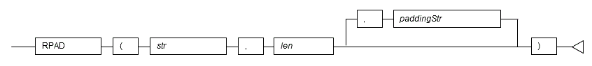 

**General rules**

 - RPAD returns the result after repeatedly padding the end of string *str* with padding characters *paddingStr* until the string reaches length *len*.
 - If the string is CHAR type, the padding characters are added to the string without removing trailing spaces.
 - In the resultant string, fullwidth characters are recognized as having a length of 2, and halfwidth characters having a length of 1. If a fullwidth character cannot be included in the resultant string because there is only space available for one halfwidth character, the string is padded with a single-byte space.
 - The data type of the return value is TEXT.

**Note**

----

The RPAD specification above uses orafce for its behavior, which is different to that of RPAD of PostgreSQL. The search_path parameter must be modified for it to behave according to the orafce specification.

----


**Information**

----

The general rules for RPAD of PostgreSQL are as follows:

 - If the string is CHAR type, trailing spaces are removed and then the padding characters are added to the string.
 - The result length is the number of characters.

----

**See**

----

 - Refer to "Notes on Using orafce" for information on how to edit search_path.
 - Refer to "The SQL Language" > "Functions and Operators" > "String Functions and Operators" in the PostgreSQL Documentation for information on RPAD.

----

**Example**

----

In the following example, a 10-character string that has been formed by right-padding the string "abc" with "a" is returned.

~~~
SELECT RPAD('abc',10,'a') FROM DUAL;
    rpad
------------
 abcaaaaaaa
(1 row)
~~~

----

#### 5.2.14 RTRIM

**Description**

Removes the specified characters from the end of a string.


**Syntax**

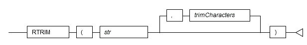 

**General rules**

 - RTRIM returns a string with *trimChars* removed from the end of string *str*.
 - If multiple trim characters are specified, all characters matching the trim characters are removed. If *trimChars* is omitted, all trailing halfwidth spaces are removed.
 - The data type of the return value is TEXT.


**Note**

----

The RTRIM specification above uses orafce for its behavior, which is different to that of RTRIM of PostgreSQL. The search_path parameter must be modified for it to behave the same as the orafce specification.

----

**Information**

----

The general rule for RTRIM of PostgreSQL is as follows:

 - If the string is CHAR type, trailing spaces are removed and then the trim characters are removed.

----


**See**

----

 - Refer to "Notes on Using orafce" for information on how to edit search_path.
 - Refer to "The SQL Language" > "Functions and Operators" > "String Functions and Operators" in the PostgreSQL Documentation for information on RTRIM.

----

**Example**

----

In the following example, a string that has had "ab" removed from the end of "aabcab" is returned.

~~~
SELECT RTRIM('aabcab','ab') FROM DUAL;
 rtrim
-------
 aabc
(1 row)
~~~

----

#### 5.2.15 SUBSTR

**Description**

Extracts part of a string using characters to specify position and length.

**Syntax**

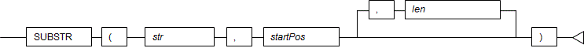 

**General rules**

 - SUBSTR extracts and returns a substring of string *str*, beginning at position *startPos*, for number of characters *len*.
 - When *startPos* is positive, it will be the number of characters from the beginning of the string.
 - When *startPos* is 0, it will be treated as 1.
 - When *startPos* is negative, it will be the number of characters from the end of the string.
 - When *len* is not specified, all characters to the end of the string are returned. NULL is returned when *len* is less than 1.
 - For *startPos* and *len*, specify an integer or NUMERIC type. If numbers including decimal places are specified, they are truncated to integers.
 - The data type of the return value is TEXT.

**Note**

----

 - There are two types of SUBSTR. One that behaves as described above and one that behaves the same as SUBSTRING. The search_path parameter must be modified for it to behave the same as the specification described above.
 - If the change has not been implemented, SUBSTR is the same as SUBSTRING.

----


**Information**

----

The general rules for SUBSTRING are as follows:

 - The start position will be from the beginning of the string, whether the start position is positive, 0, or negative.
 - When *len* is not specified, all characters to the end of the string are returned.
 - An empty string is returned if no string is extracted or *len* is less than 1.

----


**See**

----

Refer to "The SQL Language" > "Functions and Operators" > "String Functions and Operators" in the PostgreSQL Documentation for information on SUBSTRING.

----


**Example**

----

In the following example, part of the string "ABCDEFG" is extracted.

~~~
SELECT SUBSTR('ABCDEFG',3,4) "Substring" FROM DUAL;
 
 Substring
-----------
 CDEF
(1 row)

SELECT SUBSTR('ABCDEFG',-5,4) "Substring" FROM DUAL;

 Substring
-----------
 CDEF
(1 row)
~~~

----


#### 5.2.16 SUBSTRB

**Description**

Extracts part of a string using bytes to specify position and length.

**Syntax**

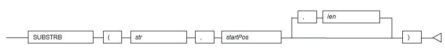 

**General rules**

 - SUBSTRB extracts and returns a substring of string *str*, beginning at byte position *startPos*, for number of bytes *len*.
 - When *startPos* is 0 or negative, extraction starts at the position found by subtracting 1 from the start position and shifting by that number of positions to the left.
 - When *len* is not specified, all bytes to the end of the string are returned.
 - An empty string is returned if no string is extracted or *len* is less than 1.
 - For *startPos* and *len*, specify a SMALLINT or INTEGER type. 
 - The data type of the return value is VARCHAR2.

**Note**

----

The external specification of SUBSTRB is different to that of SUBSTR added by orafce, conforming with SUBSTRING of PostgreSQL.

----


**Example**

----

In the following example, part of the string "aaabbbccc" is extracted.

~~~
SELECT SUBSTRB('aaabbbccc',4,3) FROM DUAL;
 substrb
-----------
 bbb
(1 row)

SELECT SUBSTRB('aaabbbccc',-2,6) FROM DUAL;
 substrb
-----------
 aaa
(1 row)
~~~

----

### 5.3 Date/time Functions

The following date/time functions are supported:

 - ADD_MONTHS
 - DBTIMEZONE
 - LAST_DAY
 - MONTHS_BETWEEN
 - NEXT_DAY
 - ROUND
 - SESSIONTIMEZONE
 - SYSDATE
 - TRUNC

**Note**

----

If the DATE type only is shown in the date/time functions, these functions can be used in both orafce and PostgreSQL.

----

#### 5.3.1 ADD_MONTHS

**Description**

Adds months to a date.

**Syntax**

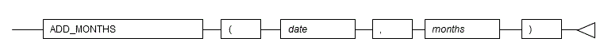 

**General rules**

 - ADD_MONTHS returns *date* plus *months*.
 - For *date*, specify a DATE type.
 - For *months*, specify a SMALLINT or INTEGER type.
 - If a negative value is specified for *months*, the number of months is subtracted from the date.
 - The data type of the return value is DATE.

**Note**

----

If using the DATE type of orafce, it is necessary to specify "oracle" for search_path in advance.

----

**See**

----

Refer to "Notes on Using orafce" for information on how to edit search_path.

----

**Example**

----

The example below shows the result of adding 3 months to the date May 1, 2016.

~~~
SELECT ADD_MONTHS(DATE'2016/05/01',3) FROM DUAL;
     add_months
---------------------
 2016-08-01 00:00:00
(1 row)
~~~

----

#### 5.3.2 DBTIMEZONE

**Description**

Returns the value of the database time zone.

**Syntax**

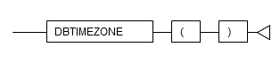 

**General rules**

 - DBTIMEZONE returns the time zone value of the database.
 - The data type of the return value is TEXT.

**Note**

----

 - If using DBTIMEZONE, it is necessary to specify "oracle" for search_path in advance.
 - The time zone of the database is set to "GMT" by default. To change the time zone, change the "orafce.timezone" parameter. An example using the SET statement is shown below.

Setting example of orafce.timezone using a SET statement

~~~
SET orafce.timezone = 'Japan';
~~~

 - The orafce.timezone settings can be set using any of the methods for setting server parameters.
 - If the SQL statement is executed with orafce.timezone set, the following message may be displayed, however, the parameter settings are enabled, so you can ignore this.

~~~
WARNING:   unrecognized configuration parameter "orafce.timezone"
~~~

 - The time zones that can be set in "orafce.timezone" are the same as for the "TimeZone" server parameter.

----


**See**

----

 - Refer to "Notes on Using orafce" for information on how to edit search_path.
 - Refer to "The SQL Language" > "Data Types" > "Date/Time Types" in the PostgreSQL Documentation for information on the time zone.

----

**Example**

----

In the following example, the DBTIMEZONE result is returned.

~~~
SELECT DBTIMEZONE() FROM DUAL;
 dbtimezone
------------
 GMT
(1 row)
~~~

----

#### 5.3.3 LAST_DAY

**Description**

Returns the last day of the month in which the specified date falls.

**Syntax**

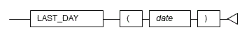 

**General rules**

 - LAST_DAY returns the last day of the month in which the specified date falls.
 - For *date*, specify a DATE type. 
 - The data type of the return value is DATE.

**Note**

----

If using the DATE type of orafce, it is necessary to specify "oracle" for search_path in advance.

----

**See**

----

Refer to "Notes on Using orafce" for information on how to edit search_path.

----

**Example**

----

In the example below, the last date of "February 01, 2016" is returned.

~~~
SELECT LAST_DAY(DATE'2016/02/01') FROM DUAL;
     last_day
---------------------
 2016-02-29 00:00:00
(1 row)
~~~

----


#### 5.3.4 MONTHS_BETWEEN

**Description**

Returns the number of months between two dates.

**Syntax**

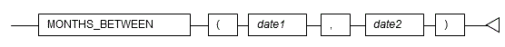 

**General rules**

 - MONTHS_BETWEEN returns the difference in the number of months between *date1* and *date2*.
 - For *date1* and *date2*, specify a DATE type. 
 - If *date2* is earlier than *date1*, the return value will be negative.
 - If two dates fall on the same day, or each of the two dates are the last day of the month to which they belong, an integer is returned. If the days are different, one month is considered to be 31 days, and a value with the difference in the number of days divided by 31 added is returned.
 - The data type of the return value is NUMERIC.

**Note**

----

If using the DATE type of orafce, it is necessary to specify "oracle" for search_path in advance.

----

**See**

----

Refer to "Notes on Using orafce" for information on how to edit search_path.

----

**Example**

----

In the following example, the difference between the months of March 15, 2016 and November 15, 2015 is returned.

~~~
SELECT MONTHS_BETWEEN(DATE'2016/03/15', DATE'2015/11/15') FROM DUAL;
 months_between
----------------
               4
(1 row)
~~~

----

#### 5.3.5 NEXT_DAY

**Description**

Returns the date of the first instance of a particular day of the week that follows the specified date.

**Syntax**

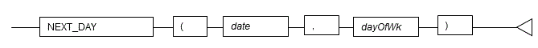 

**General rules**

 - NEXT_DAY returns the date matching the first instance of *dayOfWk* that follows *date*.
 - For *date*, specify a DATE type. 
 - Specify a numeric value or string indicating the day of the week.

**Values that can be specified for the day**

|Setting example|Overview|
|:---|:---|
|1|1 (Sunday) to 7 (Saturday) can be specified|
|'Sun', or 'Sunday'|English display of the day|
|'*'|Japanese display of the day|

 - The data type of the return value is DATE.

**Note**

----

 - If using the DATE type of orafce, it is necessary to specify "oracle" for search_path in advance.
 - The ability to use Japanese for entering days is provided by the orafce proprietary specification. Japanese cannot be used for entering days when using date/time functions other than NEXT_DAY (such as TO_DATE).

----

**See**

----

Refer to "Notes on Using orafce" for information on how to edit search_path.

----

**Example**

----

In the example below, the date of the first Friday on or after "May 1, 2016" is returned.

~~~
SELECT NEXT_DAY(DATE'2016/05/01', 'Friday') FROM DUAL;
      next_day
---------------------
 2016-05-06 00:00:00
(1 row)
~~~

----

#### 5.3.6 ROUND

**Description**

Rounds a date.

**Syntax**

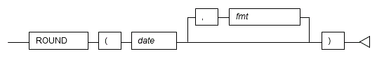 

**General rules**

 - ROUND returns a date rounded to the unit specified by format model *fmt*.
 - For *date*, specify a DATE or TIMESTAMP type. 
 - Specify the format model as a string.

**Values that can be specified for the format model**

|Format model|Rounding unit|
|:---|:---|
|Y,YY,YYY,YYYY, <br> SYYYY,YEAR,SYEAR|Year|
|I,IY,IYY,IYYY|Year (values including calendar weeks, in compliance with the ISO standard)|
|Q|Quarter|
|WW|Week (first day of the year)|
|IW|Week (Monday of that week)|
|W|Week (first weekday on which the first day of the month falls)|
|DAY,DY,D|Week (Sunday of that week)|
|MONTH,MON,MM,RM|Month|
|CC,SCC|Century|
|DDD,DD,J|Day|
|HH,HH12,HH24|Hour|
|MI|Minute|


 - If decimal places are rounded: for year, the boundary for rounding is July 1; for month, the day is 16; and for week, the weekday is Thursday.
 - If *fmt* is omitted, the date is rounded by day.
 - If the DATE type of PostgreSQL is specified for the date, that DATE type will be the data type of the return value. If the TIMESTAMP type is specified for the date, the data type will be TIMESTAMP WITH TIME ZONE, irrespective of whether a time zone is used.

**Example**

----

In the example below, the result of "June 20, 2016 18:00:00" rounded by Sunday of the week is returned.

~~~
SELECT ROUND(TIMESTAMP'2016/06/20 18:00:00','DAY') FROM DUAL;
         round
------------------------
 2016-06-19 00:00:00+09
(1 row)
~~~

----


#### 5.3.7 SESSIONTIMEZONE

**Description**

Returns the time zone of the session.

**Syntax**

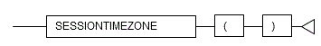 

**General rules**

 - SESSIONTIMEZONE returns the time zone value between sessions.
 - The data type of the return value is TEXT.

**Note**

----

 - If using SESSIONTIMEZONE, it is necessary to specify "oracle" for search_path in advance.
 - The value returned by SESSIONTIMEZONE becomes the value set in the "TimeZone" server parameter.

----

**See**

----

Refer to "Notes on Using orafce" for information on how to edit search_path.

----


**Example**

----

In the following example, the time zone of the session is returned.

~~~
SELECT SESSIONTIMEZONE() FROM DUAL;
 sessiontimezone
-----------------
 Japan
(1 row)
~~~

----

#### 5.3.8 SYSDATE

**Description**

Returns the system date.

**Syntax**

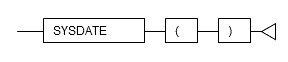 

**General rules**

 - SYSDATE returns the system date.
 - The data type of the return value is the DATE type of orafce.

**Note**

----

 - If using SYSDATE, it is necessary to specify "oracle" for search_path in advance.
 - The date returned by SYSDATE depends on the time zone value of the orafce database.

----


**See**

----

 - Refer to "Notes on Using orafce" for information on how to edit search_path.
 - Refer to "DBTIMEZONE" for information on the time zone values of the database.
 - Refer to "The SQL Language" > "Data Types" > "Date/Time Types" in the PostgreSQL Documentation for information on the time zone.

----

**Example**

----

In the following example, the system date is returned.

~~~
SELECT SYSDATE() FROM DUAL;
       sysdate
---------------------
 2016-06-22 08:06:51
(1 row)
~~~

----


#### 5.3.9 TRUNC

**Description**

Truncates a date.

**Syntax**

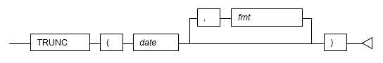 

**General rules**

 - TRUNC returns a date truncated to the unit specified by format model *fmt*.
 - For *date*, specify a DATE or TIMESTAMP type. 
 - Specify the format model as a string. The values that can be specified are the same as for ROUND.
 - If *fmt* is omitted, the date is truncated by day.
 - If the DATE type of PostgreSQL is specified for the date, that DATE type will be the data type of the return value. If the TIMESTAMP type is specified for the date, the data type will be TIMESTAMP WITH TIME ZONE, irrespective of whether a time zone is used.

**See**

----

Refer to "ROUND" for information on the values that can be specified for the format model.

----

**Example**

----

In the example below, the result of "August 10, 2016 15:30:00" truncated by the day is returned.

~~~
SELECT TRUNC(TIMESTAMP'2016/08/10 15:30:00','DDD') FROM DUAL;
         trunc
------------------------
 2016-08-10 00:00:00+09
(1 row)
~~~

----

### 5.4 Data Type Formatting Functions

The following data type formatting functions are supported:

- TO_CHAR
- TO_DATE
- TO_MULTI_BYTE
- TO_NUMBER
- TO_SINGLE_BYTE

#### 5.4.1 TO_CHAR

**Description**

Converts a value to a string.

**Syntax**

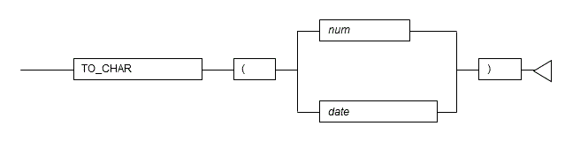 

**General rules**

 - TO_CHAR converts the specified number or date/time value to a string.
 - For *num*, specify a numeric data type.
 - For *date*, specify a DATE or TIMESTAMP type. Also, you must set a date/time format for the orafce.nls_date_format variable in advance. A setting example using the SET statement is shown below.
Setting example of orafce.nls_date_format using a SET statement

~~~
SET orafce.nls_date_format = 'YYYY/MM/DD HH24:MI:SS';
~~~

 - The data type of the return value is TEXT.

**Note**

----

 - If using TO_CHAR for specifying date/time values, it is necessary to specify "oracle" for search_path in advance.
 - The orafce.nls_date_format settings can be set using any of the methods for setting server parameters.
 - If orafce.nls_date_format is set, the following message may be displayed when an SQL statement is executed, however, the parameter settings are enabled, so you can ignore this.

~~~
WARNING:  unrecognized configuration parameter "orafce.nls_date_format"
~~~

----

**See**

----

 - Refer to "Notes on Using orafce" for information on how to edit search_path.
 - Refer to "Server Administration" > "Server Configuration" > "Setting Parameters" in the PostgreSQL Documentation for information on how to set the server parameters.

----

**Example**

----

In the following example, the numeric value "123.45" is returned as a string.

~~~
SELECT TO_CHAR(123.45) FROM DUAL;
 to_char
---------
 123.45
(1 row)
~~~

----

#### 5.4.2 TO_DATE

**Description**

Converts a string to a date in accordance with the specified format.

**Syntax**

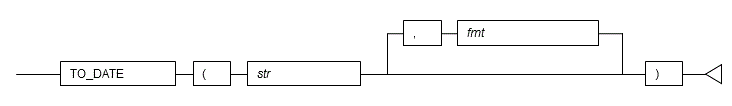 

**General rules**

 - TO_DATE converts string *str* to a date in accordance with the specified format *fmt*.
 - Specify a string indicating the date/time.
 - Specify the required date/time format. If omitted, the format specified in the oracle.nls_date_format variable is used. If the oracle.nls_date_format variable has not been set, the existing date/time input interpretation is used. A setting example using the SET statement is shown below.

**Setting example of orafce.nls_date_format using a SET statement**

~~~
SET orafce.nls_date_format = 'YYYY/MM/DD HH24:MI:SS';
~~~

 - The data type of the return value is TIMESTAMP.

**Note**

----

 - The above TO_DATE specification uses orafce for its behavior, which is different to that of TO_DATE of PostgreSQL. The search_path parameter must be modified for it to behave according to the orafce specification.
 - The orafce.nls_date_format settings can be set using any of the methods for setting server parameters.
 - If orafce.nls_date_format is set, the following message may be displayed when an SQL statement is executed, however, the parameter settings are enabled, so you can ignore this.

~~~
WARNING:   unrecognized configuration parameter "orafce.nls_date_format"
~~~

----

**Information**

----

The general rule for TO_DATE for specifying the data type format of PostgreSQL is as follows:

 - The data type of the return value is the DATE type of PostgreSQL.

----


**See**

----

 - Refer to "Notes on Using orafce" for information on how to edit search_path.
 - Refer to "The SQL Language" > "Functions and Operators" > "Data Type Formatting Functions" in the PostgreSQL Documentation for information on TO_DATE of PostgreSQL.
 - Refer to "Server Administration" > "Server Configuration" > "Setting Parameters" in the PostgreSQL Documentation for information on how to set the server parameters.
 - Refer to "Date/Time Support" > "Date/Time Input Interpretation" in the PostgreSQL Documentation for information on the interpretation of existing date/time input.

----

**Example**

----

In the following example, the string "2016/12/31" is converted to a date and returned.

~~~
SELECT TO_DATE('2016/12/31','YYYY/MM/DD') FROM DUAL;
       to_date
---------------------
 2016-12-31 00:00:00
(1 row)
~~~

----

#### 5.4.3 TO_MULTI_BYTE

**Description**

Converts a single-byte string to a multibyte string.

**Syntax**

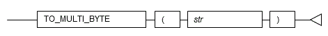 

**General rules**

 - TO_MULTI_BYTE converts halfwidth characters in string *str* to fullwidth characters, and returns the converted string.
 - Only halfwidth alphanumeric characters, spaces and symbols can be converted.
 - The data type of the return value is TEXT.

**Example**

----

In the following example, "abc123" is converted to fullwidth characters and returned.

~~~
SELECT TO_MULTI_BYTE('abc123') FROM DUAL;
 to_multi_byte
---------------
   ******   
(1 row)
~~~

"\*\*\*\*\*\*" is multibyte "abc123".

----

#### 5.4.4 TO_NUMBER

**Description**

Converts a value to a number in accordance with the specified format.

**Syntax**

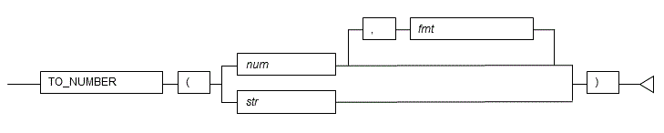 

**General rules**

 - TO_NUMBER converts the specified value to a numeric value in accordance with the specified format *fmt*.
 - For *num*, specify a numeric data type.
 - For *str*, specify a string indicating the numeric value. Numeric values must comprise only of convertible characters.
 - Specify the required numeric data format. The specified numeric value is handled as is as a data type expression.
 - The data type of the return value is NUMERIC.

**See**

----

Refer to "The SQL Language" > "Functions and Operators" > "Data Type Formatting Functions" in the PostgreSQL Documentation for information on numeric value formats.

----

**Example**

----

In the following example, the numeric literal "-130.5" is converted to a numeric value and returned.

~~~
SELECT TO_NUMBER(-130.5) FROM DUAL;
 to_number
-----------
    -130.5
(1 row)
~~~

----

#### 5.4.5 TO_SINGLE_BYTE

**Description**

Converts a multibyte string to a single-byte string.

**Syntax**

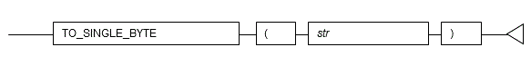 

**General rules**

 - TO_SINGLE_BYTE converts fullwidth characters in string *str* to halfwidth characters, and returns the converted string.
 - Only fullwidth alphanumeric characters, spaces and symbols that can be displayed in halfwidth can be converted.
 - The data type of the return value is TEXT.

**Example**

----

In the following example, "\*\*\*\*\*\*" is converted to halfwidth characters and returned.
"\*\*\*\*\*\*" is multibyte "xyz999".

~~~
SELECT TO_SINGLE_BYTE('******') FROM DUAL;
 to_single_byte
----------------
 xyz999
(1 row)
~~~

----

### 5.5 Conditional Expressions
The following functions for making comparisons are supported:

 - DECODE
 - GREATEST
 - LEAST
 - LNNVL
 - NANVL
 - NVL
 - NVL2

#### 5.5.1 DECODE

**Description**

Compares values and if they match, returns a corresponding value.

**Syntax**

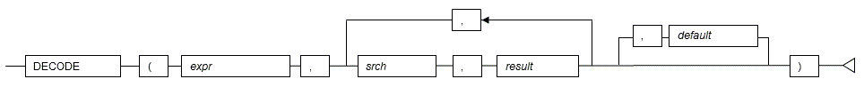 

**General rules**

 - DECODE compares values of the value expression to be converted and the search values one by one. If the values match, a corresponding result value is returned. If no values match, the default value is returned if it has been specified. A NULL value is returned if a default value has not been specified.
 - If the same search value is specified more than once, then the result value returned is the one listed for the first occurrence of the search value.
 - The following data types can be used in result values and in the default value:
     - CHAR
     - VARCHAR
     - VARCHAR2
     - NCHAR
     - NCHAR VARYING
     - NVARCHAR2
     - TEXT
     - INTEGER
     - BIGINT
     - NUMERIC
     - DATE
     - TIME WITHOUT TIME ZONE
     - TIMESTAMP WITHOUT TIME ZONE
     - TIMESTAMP WITH TIME ZONE
 - The same data type must be specified for the values to be converted and the search values. However, note that different data types may also be specified if a literal is specified in the search value, and the value expression to be converted contains data types that can be converted.
 - If the result values and default value are all literals, the data types for these values will be as shown below:
     - If all values are string literals, all will become character types.
     - If there is one or more numeric literal, all will become numeric types.
     - If there is one or more literal cast to the datetime/time types, all will become datetime/time types.
 - If the result values and default value contain a mixture of literals and non-literals, the literals will be converted to the data types of the non-literals. 
 - The same data type must be specified for all result values and for the default value. However, different data types can be specified if the data type of any of the result values or default value can be converted - these data types are listed below:


**Data type combinations that can be converted by DECODE (summary)**

<table>
 <tr>
 <td></td>
<td></td>
 <td colspan="4">  <b>Other result values or default value</b>
 </tr>
 <tr> 
  <td></td>
  <td></td>
  <td>Numeric type</td>
  <td>Character type</td> 
  <td>Date/time type</td>
  </tr>
 <tr><td rowspan="4" valign="middle"><b>Result value (any)</b></td>
 <td>Numeric type</td>
 <td align="center">Y</td>
 <td align="center">N</td>
 <td align="center">N</td>
 </tr>
 <tr>
 <td>Character type</td>
 <td align="center">N</td>
 <td align="center">Y</td>
 <td align="center">N</td>
 </tr>
 <tr>
 <td>Date/time type</td>
 <td align="center">N</td>
 <td align="center">N</td>
 <td align="center">S(*1)</td>
 </tr>
 </table>


Y: Can be converted

S: Some data types can be converted

N: Cannot be converted

*1: The data types that can be converted for date/time types are listed below:


**Result value and default value date/time data types that can be converted by DECODE**

<table>
 <tr>
 <td></td>
 <td></td>
 <td colspan="5">  <b>Other result values or default value</b>
 </tr>
 <tr> 
  <td></td> 
  <td></td>
  <td>DATE</td>
  <td>TIME <br>WITHOUT TIME ZONE</td> 
  <td>TIMESTAMP <br> WITHOUT TIME ZONE</td>
  <td>TIMESTAMP <br> WITH TIME ZONE</td>
  </tr>
 <tr><td rowspan="5" valign="middle"><b>Result value (any)</b></td>
  <td>DATE</td>
  <td align="center">Y</td>
  <td align="center">N</td>
  <td align="center">Y</td>
  <td align="center">Y</td>
 </tr>
 <tr>
  <td>TIME <br>WITHOUT TIME ZONE</td> 
 <td align="center">N</td>
 <td align="center">Y</td>
 <td align="center">N</td>
  <td align="center">N</td>
 </tr>
 <tr>
  <td>TIMESTAMP <br> WITHOUT TIME ZONE</td>
 <td align="center">Y</td>
 <td align="center">N</td>
 <td align="center">Y</td>
  <td align="center">Y</td>
 </tr>
 <tr>
  <td>TIMESTAMP <br> WITH TIME ZONE</td>
 <td align="center">Y</td>
 <td align="center">N</td>
 <td align="center">Y</td>
  <td align="center">Y</td>
 </tr>
 </table>

Y: Can be converted

N: Cannot be converted

 - The data type of the return value will be the data type within the result or default value that is longest and has the highest precision.

**Example**

----

In the following example, the value of col3 in table t1 is compared and converted to a different value. If the col3 value matches search value 1, the result value returned is "one". If the col3 value does not match any of search values 1, 2, or 3, the default value "other number" is returned.

~~~
SELECT col1,
       DECODE(col3, 1, 'one',
                    2, 'two',
                    3, 'three',
                    'other number') "num-word"
       FROM t1;
col1  | num-word
------+----------
 1001 | one
 1002 | two
 1003 | three
(3 rows)
~~~

----

#### 5.5.2 GREATEST and LEAST

**Description**

The GREATEST and LEAST functions select the largest or smallest value from a list of any number of expressions. The expressions must all be convertible to a common data type, which will be the type of the result

**Syntax**

```
GREATEST(value [, ...])

LEAST(value [, ...])
```

**General rules**

 - These two function are the same behavior than the POstgreSQL one except that instead of retunring NULL only when all parameters are NULL ,they return NULL when one of the parameters is NULL like in Oracle.

**Example**

----

In the following example, col1 and col3 of table t1 are returned when col3 has a value of 2000 or less, or null values.

~~~
SELECT GREATEST ('C', 'F', 'E')
 greatest
----------
 F 
(1 row)
~~~

~~~
\pset null ###
SELECT LEAST ('C', NULL, 'E')
 greatest
----------
 ###
(1 row)
~~~

----


#### 5.5.3 LNNVL

**Description**

Determines if a value is TRUE or FALSE for the specified condition.

**Syntax**

 

**General rules**

 - LNNVL determines if a value is TRUE or FALSE for the specified condition. If the result of the condition is FALSE or NULL, TRUE is returned. If the result of the condition is TRUE, FALSE is returned.
 - The expression for returning TRUE or FALSE is specified in the condition.
 - The data type of the return value is BOOLEAN.

**Example**

----

In the following example, col1 and col3 of table t1 are returned when col3 has a value of 2000 or less, or null values.

~~~
SELECT col1,col3 FROM t1 WHERE LNNVL( col3 > 2000 );
 col1 | col3
------+------
 1001 | 1000
 1002 | 2000
 2002 |
(3 row)
~~~

----

#### 5.5.4 NANVL

**Description**

Returns a substitute value when a value is not a number (NaN).

**Syntax**

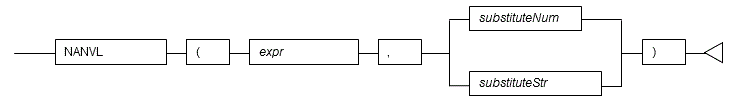 

**General rules**

 - NANVL returns a substitute value when the specified value is not a number (NaN). The substitute value can be either a number or a string that can be converted to a number.
 - For *expr* and *substituteNum*, specify a numeric data type. If *expr* and *substituteNum* have different data types, they will be converted to the data type with greater length or precision, and that is the data type that will be returned.
 - For *substituteNum*, you can also specify a string indicating the numeric value.
 - The data type used for the return value if a string is specified for the substitute value will be the same as the data type of *expr*.

**Example**

----

In the following example, "0" is returned if the value of col1 in table t1 is a NaN value.

~~~
SELECT col1, NANVL(col3,0) FROM t1;
 col1 | nanvl
------+-------
 2001 |     0
(1 row)
~~~

----

#### 5.5.5 NVL

**Description**

Returns a substitute value when a value is NULL.

**Syntax**

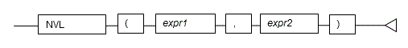 

**General rules**

 - NVL returns a substitute value when the specified value is NULL. When *expr1* is NULL, *expr2* is returned. When *expr1* is not NULL, *expr1* is returned.
 - Specify the same data types for *expr1* and *expr2*. However, if a constant is specified in *expr2*, and the data type can also be converted by *expr1*, different data types can be specified. When this happens, the conversion by *expr2* is done to suit the data type in *expr1*, so the value of *expr2* returned when *expr1* is a NULL value will be the value converted in the data type of *expr1*. This is not necessary for types (numeric, int) and (bigint, int).

**Example**

----

In the following example, "IS NULL" is returned if the value of col1 in table t1 is a NULL value.

~~~
SELECT col2, NVL(col1,'IS NULL') "nvl" FROM t1;
 col2 |   nvl
------+---------
 aaa  | IS NULL
(1 row)
~~~

----

#### 5.5.6 NVL2

**Description**

Returns a substitute value based on whether a value is NULL or not NULL.

**Syntax**

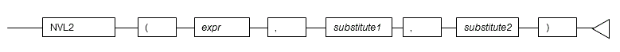 

**General rules**

 - NVL2 returns a substitute value based on whether the specified value is NULL or not NULL. When *expr* is NULL, *substitute2* is returned. When it is not NULL, *substitute1* is returned.
 - Specify the same data types for *expr*, *substitute1*, and *substitute2*. However, if a literal is specified in *substitute1* or *substitute2*, and the data type can also be converted by *expr*, different data types can be specified. When this happens, *substitute1* or *substitute2* is converted to suit the data type in *expr*, so the value of *substitute2* returned when *expr* is a NULL value will be the value converted to the data type of *expr*.


**Example**

----

In the following example, if a value in column col1 in table t1 is NULL, "IS NULL" is returned, and if not NULL, "IS NOT NULL" is returned.

~~~
SELECT col2, NVL2(col1,'IS NOT NULL','IS NULL') FROM t1;
 col2 |   nvl2
------+---------
 aaa  | IS NULL
 bbb  | IS NOT NULL
(2 row)
~~~

----

### 5.6 Aggregate Functions

The following aggregation functions are supported:

 - LISTAGG
 - MEDIAN

#### 5.6.1 LISTAGG

**Description**

Returns a concatenated, delimited list of string values.

**Syntax**

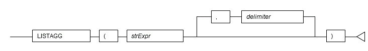 

**General rules**

 - LISTAGG concatenates and delimits a set of string values and returns the result.
 - For *delimiter*, specify a string. If the delimiter is omitted, a list of strings without a delimiter is returned.
 - The data type of the return value is TEXT.

**Example**

----

In the following example, the result with values of column col2 in table t1 delimited by ':' is returned.

~~~
SELECT LISTAGG(col2,':') FROM t1;
      listagg
-------------------
 AAAAA:BBBBB:CCCCC
(1 row)
~~~

----

#### 5.6.2 MEDIAN

**Description**

Calculates the median of a set of numbers.

**Syntax**

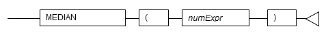 

**General rules**

 - MEDIAN returns the median of a set of numbers.
 - The numbers must be numeric data type. 
 - The data type of the return value will be REAL if the numbers are REAL type, or DOUBLE PRECISION if any other type is specified.

**Example**

----

In the following example, the median of column col3 in table t1 is returned.

~~~
SELECT MEDIAN(col3) FROM t1;
 median
--------
   2000
(1 row)
~~~

----

### 5.7 Functions That Return Internal Information

The following functions that return internal information are supported:

 - DUMP

#### 5.7.1 DUMP

**Description**

Returns internal information of a value.

**Syntax**

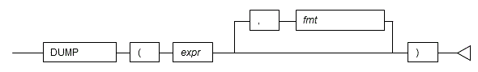 

**General rules**

 - DUMP returns the internal information of the values specified in expressions in a display format that is in accordance with the output format.
 - The internal code (Typ) of the data type, the data length (Len) and the internal expression of the data are output as internal information.
 - Any data type can be specified for the expressions.
 - The display format (base *n* ) of the internal expression of the data is specified for the output format. The base numbers that can be specified are 8, 10, and 16. If omitted, 10 is used as the default.
 - The data type of the return value is VARCHAR.

**Note**

----

The information output by DUMP will be the complete internal information. Therefore, the values may change due to product updates, and so on.

----

**Example**

----

In the following example, the internal information of column col1 in table t1 is returned.

~~~
SELECT col1, DUMP(col1) FROM t1;
 col1 |                dump
------+------------------------------------
 1001 | Typ=25 Len=8: 32,0,0,0,49,48,48,49
 1002 | Typ=25 Len=8: 32,0,0,0,49,48,48,50
 1003 | Typ=25 Len=8: 32,0,0,0,49,48,48,51
(3 row)
~~~

----

#### 5.8 Datetime Operator
The following datetime operators are supported for the DATE type of orafce.

**Datetime operator**

|Operation|Example|Result|
|:---:|:---|:---|
|+|DATE'2016/01/01' + 10|2016-01-11 00:00:00|
|-|DATE'2016/03/20' - 35|2016-02-14 00:00:00|
|-|DATE'2016/09/01' - DATE'2015/12/31'|245|

**Note**

----

If using datetime operators for the DATE type of orafce, it is necessary to specify "oracle" for search_path in advance.

----

**See**

----

Refer to "Notes on Using orafce" for information on how to edit search_path.

----

