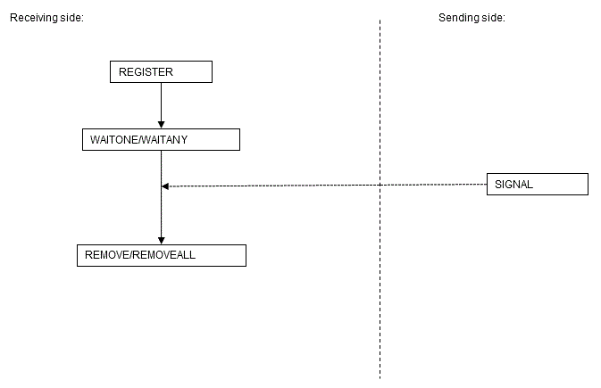

Chapter 6 Package Reference
---

A "package" is a group of features, brought together by schemas, that have a single functionality, and are used by calling from PL/pgSQL.

The following packages are supported:

 - DBMS_ALERT
 - DBMS_ASSERT
 - DBMS_OUTPUT
 - DBMS_PIPE
 - DBMS_RANDOM
 - DBMS_UTILITY
 - UTL_FILE

To call the different functionalities from PL/pgSQL, use the PERFORM statement or SELECT statement, using the package name to qualify the name of the functionality. Refer to the explanations for each of the package functionalities for information on the format for calling.

### 6.1 DBMS_ALERT

**Overview**

The DBMS_ALERT package sends alerts from a PL/pgSQL session to multiple other PL/pgSQL sessions.

This package can be used when processing 1:N, such as when notifying alerts from a given PL/pgSQL session to another PL/pgSQL session at the same time.

**Features**

| Feature | Description |
|:--- |:--- |
|REGISTER | Registers the specified alert.|
|REMOVE | Removes the specified alert.|
|REMOVEALL | Removes all alerts from a session.|
|SIGNAL|Notifies alerts.|
|WAITANY|Waits for notification of any alerts for which a session is registered.|
|WAITONE|Waits for notification of a specific alert for which a session is registered.|

**Syntax**

#### 6.1.1 Description of Features

This section explains each feature of DBMS_ALERT.

**REGISTER**

 - REGISTER registers the specified alert to a session. By registering alerts to a session, SIGNAL notifications can be received.
 - Specify the name of the alert.
 - Alerts are case-sensitive.
 - Multiple alerts can be registered within a single session. If registering multiple alerts, call REGISTER for each alert.

**Example**

----

~~~
PERFORM DBMS_ALERT.REGISTER('sample_alert');
~~~

----

**REMOVE**

 - REMOVE removes the specified alert from a session.
 - Specify the name of the alert.
 - Alerts are case-sensitive.
 - The message left by the alert will be removed.

**Example**

----

~~~
PERFORM DBMS_ALERT.REMOVE('sample_alert');
~~~

----

**REMOVEALL**

 - REMOVEALL removes all alerts registered within a session.
 - All messages left by the alerts will be removed.

**Example**

----

~~~
PERFORM DBMS_ALERT.REMOVEALL();
~~~

----

**SIGNAL**

 - SIGNAL sends a message notification for the specified alert.
 - Specify the name of the alert for which message notifications are sent.
 - Alerts are case-sensitive.
 - In the message, specify the alert message for notifications.
 - Message notifications are not complete at the stage when SIGNAL is executed. Message notifications are sent upon committing the transaction. Message notifications are discarded if a rollback is performed after SIGNAL is executed.
 - If message notifications are sent for the same alert from multiple sessions, the messages will be accumulated without being removed.

**Example**

----

~~~
PERFORM DBMS_ALERT.SIGNAL('ALERT001','message001');
~~~

----

**Note**

----

If SIGNAL is issued continuously and the accumulated messages exceed a certain amount, an insufficient memory error may be output. If the memory becomes insufficient, call AITANY or WAITONE to receive an alert, and reduce the accumulated messages.

----

**WAITANY**

 - WAITANY waits for notification of any alerts registered for a session.
 - Specify the maximum wait time *timeout* in seconds to wait for an alert.
 - Use a SELECT statement to obtain the notified information, which is stored in the name, message and status columns.
 - The name column stores the alert names. The data type of name is TEXT.
 - The message column stores the messages of notified alerts. The data type of message is TEXT.
 - The status column stores the status code returned by the operation: 0-an alert occurred; 1-a timeout occurred. The data type of status is INTEGER.

**Example**

----

~~~
DECLARE
    alert_name         TEXT := 'sample_alert';
    alert_message      TEXT;
    alert_status       INTEGER;
BEGIN
    SELECT name,message,status INTO alert_name,alert_message,alert_status FROM DBMS_ALERT.WAITANY(60);
~~~

----

**WAITONE**

 - WAITONE waits for notification of the specified alert.
 - Specify the name of the alert to wait for.
 - Alerts are case-sensitive.
 - Specify the maximum wait time *timeout* in seconds to wait for the alert.
 - Use a SELECT statement to obtain the notified information, which is stored in the message and status columns.
 - The message column stores the messages of notified alerts. The data type of message is TEXT.
 - The status column stores the status code returned by the operation: 0-an alert occurred; 1-a timeout occurred. The data type of status is INTEGER.

**Example**

----

~~~
DECLARE
    alert_message   TEXT;
    alert_status    INTEGER;
BEGIN
    SELECT message,status INTO alert_message,alert_status FROM DBMS_ALERT.WAITONE('sample_alert', 60);
~~~

----

#### 6.1.2 Usage Example
Below is a usage example of the processing flow of DBMS_ALERT.

**DBMS_ALERT flow**

**Note**

----

 - The target of message notifications by SIGNAL is sessions for which REGISTER is executed at the time of executing SIGNAL.
 - On the receiving side, always ensure that REMOVE or REMOVEALL is used to remove alerts as soon as the alerts are no longer needed. If a session is closed without removing the alerts, it may no longer be possible to receive a SIGNAL for alerts of the same name in another session.
 - DBMS_ALERT and DBMS_PIPE use the same memory environment. Therefore, when insufficient memory is detected for DBMS_PIPE, it is possible that insufficient memory will also be detected for DBMS_ALERT.

----

**Usage example**

 - Sending side

~~~
CREATE FUNCTION send_dbms_alert_exe() RETURNS VOID AS $$
BEGIN
	PERFORM DBMS_ALERT.SIGNAL('sample_alert','SIGNAL ALERT');
END;
$$ LANGUAGE plpgsql;
SELECT send_dbms_alert_exe();
DROP FUNCTION send_dbms_alert_exe();
~~~

 - Receiving side

~~~
CREATE FUNCTION receive_dbms_alert_exe() RETURNS VOID AS $$
DECLARE
	alert_name    TEXT := 'sample_alert';
	alert_message TEXT;
	alert_status  INTEGER;
BEGIN
	PERFORM DBMS_ALERT.REGISTER(alert_name);
	SELECT message,status INTO alert_message,alert_status FROM DBMS_ALERT.WAITONE(alert_name,300);
	RAISE NOTICE 'Message : %', alert_message;
	RAISE NOTICE 'Status  : %', alert_status;
	PERFORM DBMS_ALERT.REMOVE(alert_name);
END;
$$ LANGUAGE plpgsql;
SELECT receive_dbms_alert_exe();
DROP FUNCTION receive_dbms_alert_exe();
~~~

### 6.2 DBMS_ASSERT

**Overview**

Performs verification of the properties of input values in PL/pgSQL.

**Features**

|Feature|Description|
|:---|:---|
|ENQUOTE_LITERAL|Returns the specified string enclosed in single quotation marks.|
|ENQUOTE_NAME|Returns the specified string enclosed in double quotation marks.|
|NOOP|Returns the specified string as is.|
|OBJECT_NAME|Verifies if the specified string is a defined identifier.|
|QUALIFIED_SQL_NAME|Verifies if the specified string is in the appropriate format as an identifier.|
|SCHEMA_NAME|Verifies if the specified string is a defined schema.|
|SIMPLE_SQL_NAME|Verifies if the specified string is in the appropriate format as a single identifier.|

**Syntax**

#### 6.2.1 Description of Features

This section explains each feature of DBMS_ASSERT.

**ENQUOTE_LITERAL**

 - ENQUOTE_LITERAL returns the specified string enclosed in single quotation marks.
 - Specify a string enclosed in single quotation marks.
 - The data type of the return value is VARCHAR.

**Example**

----

~~~
DECLARE
    q_literal    VARCHAR(256);
BEGIN
    q_literal := DBMS_ASSERT.ENQUOTE_LITERAL('literal_word');
~~~

----

**ENQUOTE_NAME**

 - ENQUOTE_NAME returns the specified string enclosed in double quotation marks.
 - Specify a string enclosed in double quotation marks.
 - For lowercase conversion, specify TRUE or FALSE. Specify TRUE to convert uppercase characters in the string to lowercase. If FALSE is specified, conversion to lowercase will not take place. The default is TRUE.
 - If all the characters in the string are lowercase, they will not be enclosed in double quotation marks.
 - The data type of the return value is VARCHAR.

**See**

----

Refer to "The SQL Language" > "Data Types" > "Boolean Type" in the PostgreSQL Documentation for information on boolean type (TRUE/FALSE) values.

----

**Example**

----

~~~
DECLARE
    dq_literal    VARCHAR(256);
BEGIN
    dq_literal := DBMS_ASSERT.ENQUOTE_NAME('TBL001');
~~~

----

**NOOP**

 - NOOP returns the specified string as is.
 - Specify a string.
 - The data type of the return value is VARCHAR.

**Example**

----

~~~
DECLARE
    literal    VARCHAR(256);
BEGIN
    literal := DBMS_ASSERT.NOOP('NOOP_WORD');
~~~

----

**OBJECT_NAME**

 - OBJECT_NAME verifies if the specified string is a defined identifier.
 - Specify the identifier for verification. If the identifier has been defined, the specified identifier will be returned. Otherwise, the following error will occur.

~~~
ERROR:  invalid object name
~~~

 - The data type of the return value is VARCHAR.

**Example**

----

~~~
DECLARE
    object_name    VARCHAR(256);
BEGIN
    object_name := DBMS_ASSERT.OBJECT_NAME('SCM001.TBL001');
~~~

----

**QUALIFIED_SQL_NAME**

 - QUALIFIED_SQL_NAME verifies if the specified string is in the appropriate format as an identifier.
 - Specify the identifier for verification. If the string can be used as an identifier, the specified identifier will be returned. Otherwise, the following error will occur.

~~~
ERROR:  string is not qualified SQL name
~~~

 - The data type of the return value is VARCHAR.

**See**

----

Refer to "The SQL Language" > "Lexical Structure" > "Identifiers and Key Words" in the PostgreSQL Documentation for information on the formats that can be used as identifiers.

----

**Example**

----

~~~
DECLARE
    object_name    VARCHAR(256);
BEGIN
    object_name := DBMS_ASSERT.QUALIFIED_SQL_NAME('SCM002.TBL001');
~~~

----

**SCHEMA_NAME**

 - SCHEMA_NAME verifies if the specified string is a defined schema.
 - Specify a schema name for verification. If the schema has been defined, the specified schema name will be returned. Otherwise, the following error will occur.

~~~
ERROR:  invalid schema name
~~~

 - The data type of the return value is VARCHAR.

**Example**

----

~~~
DECLARE
    schema_name    VARCHAR(256);
BEGIN
    schema_name := DBMS_ASSERT.SCHEMA_NAME('SCM001');
~~~

----

**SIMPLE_SQL_NAME**

 - SIMPLE_SQL_NAME verifies if the specified string is in the appropriate format as a single identifier.
 - Specify an identifier for verification. If the specified string can be used as an identifier, the specified identifier will be returned. Otherwise, the following error will occur.

~~~
ERROR:  string is not qualified SQL name
~~~

 - The data type of the return value is VARCHAR.

**See**

----

Refer to "The SQL Language" > "Lexical Structure" > "Identifiers and Key Words" in the PostgreSQL Documentation for information on the formats that can be used as identifiers. Note that an error will occur if an identifier using fullwidth characters is specified. If fullwidth characters are included, specify a quoted identifier.

----

**Example**

----

~~~
DECLARE
    simple_name    VARCHAR(256);
BEGIN
    simple_name := DBMS_ASSERT.SIMPLE_SQL_NAME('COL01');
~~~

----

#### 6.2.2 Usage Example
A usage example of DBMS_ASSERT is shown below.
~~~
CREATE FUNCTION dbms_assert_exe() RETURNS VOID AS $$
DECLARE
	w_schema VARCHAR(20) := 'public';
	w_table  VARCHAR(20) := 'T1';
	w_object VARCHAR(40);
BEGIN
	PERFORM DBMS_ASSERT.NOOP(w_schema);
	PERFORM DBMS_ASSERT.SIMPLE_SQL_NAME(w_table);
	PERFORM DBMS_ASSERT.SCHEMA_NAME(w_schema);
	w_object := w_schema || '.' || w_table;
	PERFORM DBMS_ASSERT.QUALIFIED_SQL_NAME(w_object);
	PERFORM DBMS_ASSERT.OBJECT_NAME(w_object);
	RAISE NOTICE 'OBJECT     : %', DBMS_ASSERT.ENQUOTE_LITERAL(w_object);
	RAISE NOTICE 'TABLE_NAME : %', DBMS_ASSERT.ENQUOTE_NAME(w_table);
END;
$$
LANGUAGE plpgsql;
SELECT dbms_assert_exe();
DROP FUNCTION dbms_assert_exe();
~~~

### 6.3 DBMS_OUTPUT

**Overview**

Sends messages to clients such as psql from PL/pgSQL.

**Features**

|Feature|Description|
|:---|:---|
|ENABLE|Enables features of this package.|
|DISABLE|Disables features of this package.|
|SERVEROUTPUT|Controls whether messages are sent.|
|PUT|Sends messages.|
|PUT_LINE|Sends messages with a newline character appended.|
|NEW_LINE|Sends a newline character.|
|GET_LINE|Retrieves a line from the message buffer.|
|GET_LINES|Retrieves multiple lines from the message buffer.|

**Syntax**

#### 6.3.1 Description
This section explains each feature of DBMS_OUTPUT.

**ENABLE**

 - ENABLE enables the use of PUT, PUT_LINE, NEW_LINE, GET_LINE, and GET_LINES.
 - With multiple executions of ENABLE, the value specified last is the buffer size (in bytes). Specify a buffer size from 2000 to 1000000.
 - The default value of the buffer size is 20000. If NULL is specified as the buffer size, 1000000 will be used.
 - If ENABLE has not been executed, PUT, PUT_LINE, NEW_LINE, GET_LINE, and GET_LINES are ignored even if they are executed.

**Example**

----

~~~
PERFORM DBMS_OUTPUT.ENABLE(20000);
~~~

----

**DISABLE**

 - DISABLE disables the use of PUT, PUT_LINE, NEW_LINE, GET_LINE, and GET_LINES.
 - Remaining buffer information is discarded.

**Example**

----

~~~
PERFORM DBMS_OUTPUT.DISABLE();
~~~

----

**SERVEROUTPUT**

 - SERVEROUTPUT controls whether messages are sent.
 - Specify TRUE or FALSE for *sendMsgs*.
 - If TRUE is specified, when PUT, PUT_LINE, or NEW_LINE is executed, the message is sent to a client such as psql and not stored in the buffer.
 - If FALSE is specified, when PUT, PUT_LINE, or NEW_LINE is executed, the message is stored in the buffer and not sent to a client such as psql.

**See**

----

Refer to "The SQL Language" > "Data Types" > "Boolean Type" in the PostgreSQL Documentation for information on boolean type (TRUE/FALSE) values.

----

**Example**

----

~~~
PERFORM DBMS_OUTPUT.SERVEROUTPUT(TRUE);
~~~

----

**PUT**

 - PUT sets the message to be sent.
 - The string is the message to be sent.
 - When TRUE is specified for SERVEROUTPUT, the messages are sent to clients such as psql.
 - When FALSE is specified for SERVEROUTPUT, the messages are retained in the buffer.
 - PUT does not append a newline character. To append a newline character, execute NEW_LINE.
 - If a string longer than the buffer size specified in ENABLE is sent, an error occurs.

**Example**

----

~~~
PERFORM DBMS_OUTPUT.PUT('abc');
~~~

----

**PUT_LINE**

 - PUT_LINE sets the message to be sent appended with a newline character.
 - The string is the message to be sent.
 - When TRUE is specified for SERVEROUTPUT, the messages are sent to clients such as psql.
 - When FALSE is specified for SERVEROUTPUT, the messages are retained in the buffer.
 - If a string longer than the buffer size specified in ENABLE is sent, an error occurs.

**Example**

----

~~~
PERFORM DBMS_OUTPUT.PUT_LINE('abc');
~~~

----

**NEW_LINE**

 - NEW_LINE appends a newline character to the message created with PUT.
 - When TRUE is specified for SERVEROUTPUT, the messages are sent to clients such as psql.
 - When FALSE is specified for SERVEROUTPUT, the messages are retained in the buffer.

**Example**

----

~~~
PERFORM DBMS_OUTPUT.NEW_LINE();
~~~

----

**GET_LINE**

 - GET_LINE retrieves a line from the message buffer.
 - Use a SELECT statement to obtain the retrieved line and status code returned by the operation, which are stored in the line and status columns.
 - The line column stores the line retrieved from the buffer. The data type of line is TEXT.
 - The status column stores the status code returned by the operation: 0-completed successfully; 1-failed because there are no more lines in the buffer. The data type of status is INTEGER.
 - If GET_LINE or GET_LINES is executed and then PUT, PUT_LINE or PUT_LINES is executed while messages that have not been retrieved from the buffer still exist, the messages not retrieved from the buffer will be discarded.

**Example**

----

~~~
DECLARE
    buff1   VARCHAR(20);
    stts1   INTEGER;
BEGIN
    SELECT line,status INTO buff1,stts1 FROM DBMS_OUTPUT.GET_LINE();
~~~

----

**GET_LINES**

 - GET_LINES retrieves multiple lines from the message buffer.
 - Specify the number of lines to retrieve from the buffer.
 - Use a SELECT statement to obtain the retrieved lines and the number of lines retrieved, which are stored in the lines and numlines columns.
 - The lines column stores the lines retrieved from the buffer. The data type of lines is TEXT.
 - The numlines column stores the number of lines retrieved from the buffer. If this number is less than the number of lines requested, then there are no more lines in the buffer. The data type of numlines is INTEGER.
 - If GET_LINE or GET_LINES is executed and then PUT, PUT_LINE, or NEW_LINE is executed while messages that have not been retrieved from the buffer still exist, the messages not retrieved from the buffer will be discarded.

**Example**

----

~~~
DECLARE
    buff    VARCHAR(20)[10];
    stts    INTEGER := 10;
BEGIN
    SELECT lines, numlines INTO buff,stts FROM DBMS_OUTPUT.GET_LINES(stts);
~~~

----

#### 6.3.2 Usage Example

A usage example of DBMS_OUTPUT is shown below.

~~~
CREATE TABLE dbms_output_table(c1 text, c2 int);
CREATE FUNCTION dbms_output_exe() RETURNS VOID AS $$
DECLARE
	buff1 VARCHAR(20);
	stts1 INTEGER;
BEGIN
	PERFORM DBMS_OUTPUT.SERVEROUTPUT(TRUE);
	PERFORM DBMS_OUTPUT.ENABLE();
	PERFORM DBMS_OUTPUT.PUT('DBMS_OUTPUT TEST 1');
	PERFORM DBMS_OUTPUT.NEW_LINE();
	PERFORM DBMS_OUTPUT.PUT_LINE('DBMS_OUTPUT TEST 2');

	PERFORM DBMS_OUTPUT.SERVEROUTPUT(FALSE);
	PERFORM DBMS_OUTPUT.ENABLE();
	PERFORM DBMS_OUTPUT.PUT_LINE('DBMS_OUTPUT TEST 3');
	SELECT line,status INTO buff1,stts1 FROM DBMS_OUTPUT.GET_LINE();
	INSERT INTO dbms_output_table VALUES(buff1,stts1);
END;
$$ LANGUAGE plpgsql;
SELECT dbms_output_exe();
SELECT * FROM dbms_output_table;
DROP FUNCTION dbms_output_exe();
DROP TABLE dbms_output_table;
~~~

### 6.4 DBMS_PIPE

**Overview**

Performs communication between sessions that execute PL/pgSQL.

This package can be used for 1:1 communication, such as when data is being exchanged between sessions executing PL/pgSQL.

For pipes, there are explicit pipes and implicit pipes, and furthermore, for explicit pipes, you can select public pipes and private pipes. The characteristics of each type are as follows:

**Types of pipes**

|Type|Characteristics|
|:---|:---|
|Explicit pipe|- CREATE_PIPE is used to create a pipe explicitly.   - While creating a pipe,   you can select between a public pipe and private pipe.   - It is necessary to use REMOVE_PIPE to explicitly remove a pipe.|
|Implicit pipe|- Created automatically when SEND_MESSAGE and RECEIVE_MESSAGE are used.   - The pipe that is created becomes a public pipe.   - When messages are received using RECEIVE_MESSAGE,   if there are no additional messages remaining in the pipe,   the pipe will be removed automatically.|
|Public pipe|- Can be created as an explicit pipe or implicit pipe.   - Can also be used by users other than the creator.|
|Private pipe|- Can only be created as an explicit pipe.   - Can only be used by its creator.|

**Note**

----

 - Up to 50 pipes can be used concurrently by a single instance.
 - In cases where pipes are frequently created and removed repetitively, use public pipes. If you create a private pipe, internal information (the creator of the private pipe) will remain even after the pipe is removed. Thus, repeatedly creating and removing pipes may ultimately cause memory to run out.
 - If a timeout occurs without receiving a message when an implicit pipe is created by RECEIVE_MESSAGE, the pipe will not be removed.

----

**Features**

|Feature|Description|
|:---|:---|
|CREATE_PIPE|Creates a public or private pipe.|
|NEXT_ITEM_TYPE|Determines the data type of the next item in the local buffer, and returns that type.|
|PACK_MESSAGE|Sets a message in the local buffer.|
|PURGE|Empties the contents of the specified pipe.|
|RECEIVE_MESSAGE|Sets a received message in the local buffer.|
|REMOVE_PIPE|Removes the specified pipe.|
|RESET_BUFFER|Resets the set position of the local buffer.|
|SEND_MESSAGE|Sends the contents of the local buffer.|
|UNIQUE_SESSION_NAME|Returns a unique session name.|
|UNPACK_MESSAGE_BYTEA|Receives a message in the local buffer in BYTEA type.|
|UNPACK_MESSAGE_DATE|Receives a message in the local buffer in DATE type.|
|UNPACK_MESSAGE_NUMBER|Receives a message in the local buffer in NUMERIC type.|
|UNPACK_MESSAGE_RECORD|Receives a message in the local buffer in RECORD type.|
|UNPACK_MESSAGE_TEXT|Receives a message in the local buffer in TEXT type.|
|UNPACK_MESSAGE_TIMESTAMP|Receives a message in the local buffer in TIMESTAMP type.|

**Syntax**

#### 6.4.1 Description of Features

This section explains each feature of DBMS_PIPE.

**CREATE_PIPE**

 - CREATE_PIPE explicitly creates a pipe environment for data communication.
 - Specify the name of the pipe to be created.
 - Pipe names are case-sensitive.
 - Specify the maximum number of messages that can be sent or received. If omitted, 0 (cannot send messages) will be used. Specify from 1 to 32767.
 - Specify TRUE or FALSE for *private*. If TRUE is specified, a private pipe will be created. If FALSE is specified, a public pipe will be created. The default is FALSE.
 - An error will occur if a pipe of the same name has already been created.

**See**

----

Refer to "The SQL Language" > "Data Types" > "Boolean Type" in the PostgreSQL Documentation for information on boolean type (TRUE/FALSE) values.

---

**Example**

----

~~~
PERFORM DBMS_PIPE.CREATE_PIPE('P01', 100, FALSE);
~~~

----

**NEXT_ITEM_TYPE**

 - NEXT_ITEM_TYPE returns the next data type in the local buffer.
 - The data type of the return value is INTEGER. One of the following values is returned:

**Values returned by NEXT_ITEM_TYPE**

|Return value|Data type|
|:---|:---|
|9|NUMERIC type|
|11|TEXT type|
|12|DATE type|
|13|TIMESTAMP type|
|23|BYTEA type|
|24|RECORD type|
|0|No data in the buffer|

**Example**

----

~~~
DECLARE
    i_iType    INTEGER;
BEGIN
    i_iType := DBMS_PIPE.NEXT_ITEM_TYPE();
~~~

----

**PACK_MESSAGE**

 - PACK_MESSAGE sets the specified message in the local buffer.
 - Specify the data to be set in the local buffer. The following data types can be used:
     - Character type (\*1)
     - Integer type (\*2)
     - NUMERIC type
     - DATE type
     - TIMESTAMP type (\*3)
     - BYTEA type
     - RECORD type

\*1: The character type is converted internally to TEXT type.

\*2: The integer type is converted internally to NUMERIC type.

\*3: The TIMESTAMP type is converted internally to TIMESTAMP WITH TIME ZONE type.

 - Each time PACK_MESSAGE is called, a new message is added to the local buffer.
 - The size of the local buffer is approximately 8 KB. However, each message has overhead, so the total size that can be stored is actually less than 8 KB. To clear the local buffer, send a message (SEND_MESSAGE), or reset the buffer (RESET_BUFFER) to its initial state.

**Example**

----

~~~
PERFORM DBMS_PIPE.PACK_MESSAGE('Message Test001');
~~~

----

**PURGE**

 - PURGE removes the messages in the pipe.
 - Specify the name of the pipe for which the messages are to be removed.
 - Pipe names are case-sensitive.

**Example**

----

~~~
PERFORM DBMS_PIPE.PURGE('P01');
~~~

----

**Note**

----

When PURGE is executed, the local buffer is used to remove the messages in the pipe. Therefore, if there are any messages remaining in the pipe, the local buffer will be overwritten by PURGE.

----

**RECEIVE_MESSAGE**

 - RECEIVE_MESSAGE receives messages that exist in the specified pipe, and sets those messages in the local buffer.
 - Messages are received in the units in which they are sent to the pipe by SEND_MESSAGE. Received messages are removed from the pipe after being set in the local buffer.
 - Specify the name of the pipe for which the messages are to be received.
 - Pipe names are case-sensitive.
 - Specify the maximum wait time *timeout* in seconds to wait for a message. If omitted, the default is 31536000 seconds (1 year).
 - The data type of the return value is INTEGER. If a message is received successfully, 0 is returned. If a timeout occurs, 1 is returned.

**Example**

----

~~~
DECLARE
    i_Ret    INTEGER;
BEGIN
    i_Ret := DBMS_PIPE.RECEIVE_MESSAGE('P01', 60);
~~~

----

**REMOVE_PIPE**

 - REMOVE_PIPE removes the specified pipe.
 - Specify the name of the pipe to be removed.
 - Pipe names are case-sensitive.

**Example**

----

~~~
PERFORM DBMS_PIPE.REMOVE_PIPE('P01');
~~~

----

**RESET_BUFFER**

 - RESET_BUFFER resets the set position of the local buffer. Any unnecessary data remaining in the local buffer can be discarded using this operation.

**Example**

----

~~~
PERFORM DBMS_PIPE.RESET_BUFFER();
~~~

----

**SEND_MESSAGE**

 - SEND_MESSAGE sends data stored in the local buffer to the specified pipe.
 - Specify the name of the pipe that the data is to be sent to.
 - Pipe names are case-sensitive.
 - Specify the maximum wait time *timeout* in seconds for sending data stored in the local buffer. If omitted, the default is 31536000 seconds (1 year).
 - Specify the maximum number of messages that can be sent or received. If omitted, the maximum number of messages set in CREATE_PIPE is used. If omitted in the implicit pipe, the number of messages will be unlimited. Specify from 1 to 32767.
 - If the maximum number of messages is specified in both SEND_MESSAGE and CREATE_PIPE, the larger of the values will be used.
 - The data type of the return value is INTEGER. If a message is received successfully, 0 is returned. If a timeout occurs, 1 is returned.

**Example**

----

~~~
DECLARE
    i_Ret    INTEGER;
BEGIN
    i_Ret := DBMS_PIPE.SEND_MESSAGE('P01', 10, 20);
~~~

----

**Note**

----

A timeout will occur during sending if the maximum number of messages is reached, or if the message being sent is too large. If a timeout occurs, use RECEIVE_MESSAGE to receive any messages that are in the pipe.

----

**UNIQUE_SESSION_NAME**

 - UNIQUE_SESSION_NAME returns a name that is unique among all the sessions. This name can be used as the pipe name.
 - Multiple calls from the same session always return the same name.
 - The data type of the return value is VARCHAR. Returns a string of up to 30 characters.

**Example**

----

~~~
DECLARE
    p_Name   VARCHAR(30);
BEGIN
    p_Name := DBMS_PIPE.UNIQUE_SESSION_NAME();
~~~

----

**UNPACK_MESSAGE_BYTEA**

 - NPACK_MESSAGE_BYTEA receives BTYEA type messages in the local buffer.
 - Messages are received in the unit set in the local buffer by PACK_MESSAGE. Received messages are removed from the local buffer.
 - The data type of the return value is BYTEA.
 - If no messages exist in the local buffer, a NULL value is returned.
 - For the data type, it is necessary to align with the data type set by PACK_MESSAGE. If the data type is different, the following error will occur.

~~~
ERROR:  datatype mismatch
DETAIL:  unpack unexpected type: xx
~~~

**Example**

----

~~~
DECLARE
    g_Bytea   BYTEA;
BEGIN
    g_Bytea := DBMS_PIPE.UNPACK_MESSAGE_BYTEA();
~~~

----

**UNPACK_MESSAGE_DATE**

 - UNPACK_MESSAGE_DATE receives DATE type messages in the local buffer.
 - Messages are received in the unit set in the local buffer by PACK_MESSAGE. Received messages are removed from the local buffer.
 - The data type of the return value is DATE.
 - If no messages exist in the local buffer, a NULL value is returned.
 - For the data type, it is necessary to align with the data type set by PACK_MESSAGE. If the data type is different, the following error will occur.

~~~
ERROR:  datatype mismatch
DETAIL:  unpack unexpected type: xx
~~~

**Example**

----

~~~
DECLARE
    g_Date   DATE;
BEGIN
    g_Date := DBMS_PIPE.UNPACK_MESSAGE_DATE();
~~~

----

**Note**

----

If the "oracle" schema is set in search_path, the DATE type of orafce will be used, so for receiving data, use UNPACK_MESSAGE_TIMESTAMP. UNPACK_MESSAGE_DATE is the interface for the DATE type of PostgreSQL.

----

**UNPACK_MESSAGE_NUMBER**

 - UNPACK_MESSAGE_NUMBER receives NUMERIC type messages in the local buffer.
 - Messages are received in the unit set in the local buffer by PACK_MESSAGE. Received messages are removed from the local buffer.
 - The data type of the return value is NUMERIC.
 - If no messages exist in the local buffer, a NULL value is returned.
 - For the data type, it is necessary to align with the data type set by PACK_MESSAGE. If the data type is different, the following error will occur.

~~~
ERROR:  datatype mismatch
DETAIL:  unpack unexpected type: xx
~~~

**Example**

----

~~~
DECLARE
    g_Number   NUMERIC;
BEGIN
    g_Number := DBMS_PIPE.UNPACK_MESSAGE_NUMBER();
~~~

----

**UNPACK_MESSAGE_RECORD**

 - UNPACK_MESSAGE_RECORD receives RECORD type messages in the local buffer.
 - Messages are received in the unit set in the local buffer by PACK_MESSAGE. Received messages are removed from the local buffer.
 - The data type of the return value is RECORD.
 - If no messages exist in the local buffer, a NULL value is returned.
 - For the data type, it is necessary to align with the data type set by PACK_MESSAGE. If the data type is different, the following error will occur.

~~~
ERROR:  datatype mismatch
DETAIL:  unpack unexpected type: xx
~~~

**Example**

----

~~~
DECLARE
    msg1     TEXT;
    status   NUMERIC;
BEGIN
    SELECT col1, col2 INTO msg1, status FROM DBMS_PIPE.UNPACK_MESSAGE_RECORD();
~~~

----

**UNPACK_MESSAGE_TEXT**

 - UNPACK_MESSAGE_TEXT receives TEXT type messages in the local buffer.
 - Messages are received in the unit set in the local buffer by PACK_MESSAGE. Received messages are removed from the local buffer.
 - The data type of the return value is TEXT.
 - If no messages exist in the local buffer, a NULL value is returned.
 - For the data type, it is necessary to align with the data type set by PACK_MESSAGE. If the data type is different, the following error will occur.

~~~
ERROR:  datatype mismatch
DETAIL:  unpack unexpected type: xx
~~~

**Example**

----

~~~
DECLARE
    g_Text   TEXT;
BEGIN
    g_Text := DBMS_PIPE.UNPACK_MESSAGE_TEXT();
~~~

----

**UNPACK_MESSAGE_TIMESTAMP**

 - UNPACK_MESSAGE_TIMESTAMP receives TIMESTAMP WITH TIME ZONE type messages in the local buffer.
 - Messages are received in the unit set in the local buffer by PACK_MESSAGE. Received messages are removed from the local buffer.
 - The data type of the return value is TIMESTAMP WITH TIME ZONE.
 - If no messages exist in the local buffer, a NULL value is returned.
 - For the data type, it is necessary to align with the data type set by PACK_MESSAGE. If the data type is different, the following error will occur.

~~~
ERROR:  datatype mismatch
DETAIL:  unpack unexpected type: xx
~~~

**Example**

----

~~~
DECLARE
    g_Timestamptz   TIMESTAMP WITH TIME ZONE;
BEGIN
    g_Timestamptz := DBMS_PIPE.UNPACK_MESSAGE_TIMESTAMP();
~~~

----

#### 6.4.2 Usage Example
Below is a usage example of the processing flow of DBMS_PIPE.

**Flow of DBMS_PIPE**

**Note**

----

 - When CREATE_PIPE is used to explicitly create a pipe, ensure to use REMOVE_PIPE to remove the pipe. If a pipe is not removed explicitly, once created, it will remain until the instance is stopped.
 - In the flow diagram, CREATE_PIPE and REMOVE_PIPE are described on the receiving side, however, these can be executed on the sending side. In order to maintain consistency, it is recommended to create and remove pipes on one side.
 - An error will occur for CREATE_PIPE if a pipe of the same name already exists. Implicitly created pipes are also the target of SEND_MESSAGE and RECEIVE_MESSAGE, so when executing CREATE_PIPE, ensure that SEND_MESSAGE and RECEIVE_MESSAGE are not called beforehand.
 - DBMS_ALERT and DBMS_PIPE use the same memory environment. Therefore, when insufficient memory is detected for DBMS_ALERT, it is possible that insufficient memory will also be detected for DBMS_PIPE.

----

**Information**

----

The information of pipes that are in use can be viewed in the DBMS_PIPE.DB_PIPES view.

~~~
SELECT * from dbms_pipe.db_pipes;
 name | items | size | limit | private | owner
------+-------+------+-------+---------+-------
 P01  |     1 |   18 |   100 | f       |
(1 row)
~~~

----

**Usage example**

 - Sending side

~~~
CREATE FUNCTION send_dbms_pipe_exe(IN pipe_mess text) RETURNS void AS $$
DECLARE
	pipe_name text := 'sample_pipe';
	pipe_time timestamp := current_timestamp;
	pipe_stat int;
BEGIN
	PERFORM DBMS_PIPE.RESET_BUFFER();
	PERFORM DBMS_PIPE.PACK_MESSAGE(pipe_mess);
	PERFORM DBMS_PIPE.PACK_MESSAGE(pipe_time);
	pipe_stat := DBMS_PIPE.SEND_MESSAGE(pipe_name); 
	RAISE NOTICE 'PIPE_NAME: % SEND Return Value =%', pipe_name, pipe_stat;
END;
$$ LANGUAGE plpgsql;

SELECT send_dbms_pipe_exe('Sample Message.');
DROP FUNCTION send_dbms_pipe_exe(text);
~~~

 - Receiving side

~~~
CREATE FUNCTION receive_dbms_pipe_exe() RETURNS void AS $$
DECLARE
	pipe_name text := 'sample_pipe';
	pipe_text text;
	pipe_nume numeric;
	pipe_date date;
	pipe_time timestamp with time zone;
	pipe_byte bytea;
	pipe_reco record;
	pipe_item int;
	pipe_stat int;
BEGIN
	pipe_stat := DBMS_PIPE.RECEIVE_MESSAGE(pipe_name,300);
	RAISE NOTICE 'Return Value = %', pipe_stat;
	LOOP
		pipe_item := DBMS_PIPE.NEXT_ITEM_TYPE();
		RAISE NOTICE 'Next Item : %', pipe_item;
		IF (pipe_item = 9) THEN
			pipe_nume := DBMS_PIPE.UNPACK_MESSAGE_NUMBER();
			RAISE NOTICE 'Get Message : %' ,pipe_nume;
		ELSIF (pipe_item =11) THEN
			pipe_text := DBMS_PIPE.UNPACK_MESSAGE_TEXT();
			RAISE NOTICE 'Get Message : %' ,pipe_text;
		ELSIF (pipe_item = 12) THEN
			pipe_date := DBMS_PIPE.UNPACK_MESSAGE_DATE();
			RAISE NOTICE 'Get Message : %' ,pipe_date;
		ELSIF (pipe_item = 13) THEN
			pipe_time := DBMS_PIPE.UNPACK_MESSAGE_TIMESTAMP();
			RAISE NOTICE 'Get Message : %' ,pipe_time;
		ELSIF (pipe_item = 23) THEN
			pipe_byte := DBMS_PIPE.UNPACK_MESSAGE_BYTEA();
			RAISE NOTICE 'Get Message : %' ,pipe_byte;
		ELSIF (pipe_item = 24) THEN
			pipe_reco := DBMS_PIPE.UNPACK_MESSAGE_RECORD();
			RAISE NOTICE 'Get Message : %' ,pipe_reco;
		ELSE
			EXIT;
		END IF;
	END LOOP;
	PERFORM DBMS_PIPE.REMOVE_PIPE(pipe_name);
END;
$$ LANGUAGE plpgsql;

SELECT receive_dbms_pipe_exe();
DROP FUNCTION receive_dbms_pipe_exe();
~~~

### 6.5 DBMS_RANDOM

**Overview**

Generates random numbers in PL/pgSQL.

**Features**

|Feature|Description|
|:---|:---|
|INITIALIZE|Initializes the generation of random numbers.|
|NORMAL|Returns a normally distributed random number.|
|RANDOM|Generates a random number.|
|SEED|Resets the seed value.|
|STRING|Generates a random string.|
|TERMINATE|Terminates generation of random numbers.|
|VALUE|Generates a random decimal number between 0 and 1, or between specified values.|

**Syntax**

#### 6.5.1 Description of Features

This section explains each feature of DBMS_RANDOM.

**INITIALIZE**

 - INITIALIZE initializes the generation of random numbers using the specified seed value.
 - For *seedVal*, specify a SMALLINT or INTEGER type.

**Example**

----

~~~
PERFORM DBMS_RANDOM.INITIALIZE(999);
~~~

----

**NORMAL**

 - NORMAL generates and returns a normally distributed random number.
 - The return value type is DOUBLE PRECISION.

**Example**

----

~~~
DECLARE
    d_RunNum   DOUBLE PRECISION;
BEGIN
    d_RunNum := DBMS_RANDOM.NORMAL();
~~~

----

**RANDOM**

 - RANDOM generates and returns a random number.
 - The data type of the return value is INTEGER.

**Example**

----

~~~
DECLARE
    d_RunInt   INTEGER;
BEGIN
    d_RunInt := DBMS_RANDOM.RANDOM();
~~~

----

**SEED**

 - SEED initializes the generation of a random number using the specified seed value or seed string.
 - For *seedVal*, specify a SMALLINT or INTEGER type. 
 - Any string can be specified for the seed string.

**Example**

----

~~~
PERFORM DBMS_RANDOM.SEED('123');
~~~

----

**STRING**

 - STRING generates and returns a random string in accordance with the specified display format and string length.
 - For the display format *fmt*, specify any of the following values. An error will occur if any other value is specified.

**Values that can be specified for the display format**

|Setting value|Generated string|
|:---|:---|
|'u', 'U'|Uppercase letters only|
|'l', 'L'|Lowercase letters only|
|'a', 'A'|Mixture of uppercase and lowercase letters|
|'x', 'X'|Uppercase letters and numbers|
|'p', 'P'|Any displayable character|

 - Specify the length of the string to be generated. Specify a SMALLINT or INTEGER type.
 - The data type of the return value is TEXT.

**Example**

----

~~~
DECLARE
    d_RunStr   TEXT;
BEGIN
    d_RunStr := DBMS_RANDOM.STRING('a', 20);
~~~

----

**TERMINATE**

 - Call TERMINATE to terminate generation of random numbers.

**Information**

TERMINATE does not do anything, but has been included for compatibility with Oracle databases.

**Example**

----

~~~
PERFORM DBMS_RANDOM.TERMINATE();
~~~

----

**VALUE**

 - VALUE generates and returns a random number within the specified range.
 - For *min* and *max*, specify a numeric data type. A random number between and inclusive of the minimum value and maximum value is generated.
 - If the minimum value and maximum value are omitted, a random decimal number between 0 and 1 will be generated.
 - The data type of the return value is DOUBLE PRECISION.

**Example**

----

~~~
DECLARE
    d_RunDbl   DOUBLE PRECISION;
BEGIN
    d_RunDbl := DBMS_RANDOM.VALUE();
~~~

----

#### 6.5.2 Usage Example

A usage example of DBMS_RANDOM is shown below.

~~~
CREATE FUNCTION dbms_random_exe() RETURNS VOID AS $$
DECLARE
	w_rkey VARCHAR(10) := 'rnd111';
	i_rkey INTEGER := 97310;
BEGIN
	PERFORM DBMS_RANDOM.INITIALIZE(i_rkey);
	RAISE NOTICE 'RANDOM -> NORMAL : %', DBMS_RANDOM.NORMAL();
	RAISE NOTICE 'RANDOM -> RANDOM : %', DBMS_RANDOM.RANDOM();
	RAISE NOTICE 'RANDOM -> STRING : %', DBMS_RANDOM.STRING('a',10);
	RAISE NOTICE 'RANDOM -> VALUE  : %', DBMS_RANDOM.VALUE();
	PERFORM DBMS_RANDOM.SEED(w_rkey);
	RAISE NOTICE 'RANDOM -> NORMAL : %', DBMS_RANDOM.NORMAL();
	RAISE NOTICE 'RANDOM -> RANDOM : %', DBMS_RANDOM.RANDOM();
	RAISE NOTICE 'RANDOM -> STRING : %', DBMS_RANDOM.STRING('p',10);
	RAISE NOTICE 'RANDOM -> VALUE  : %', DBMS_RANDOM.VALUE(1,100);
	PERFORM DBMS_RANDOM.TERMINATE();
END;
$$ LANGUAGE plpgsql;
SELECT dbms_random_exe();
DROP FUNCTION dbms_random_exe();
~~~

### 6.6 DBMS_UTILITY

**Overview**

Provides utilities of PL/pgSQL.

**Features**

|Feature|Description|
|:---|:---|
|FORMAT_CALL_STACK|Returns the current call stack.|
|GET_TIME|Returns the number of hundredths of seconds that have elapsed since a point in time in the past.|

**Syntax**

#### 6.6.1 Description of Features

This section explains each feature of DBMS_UTILITY.

**FORMAT_CALL_STACK**

 - FORMAT_CALL_STACK returns the current call stack of PL/pgSQL.
 - For the display format fmt, specify any of the following values. An error will occur if any other value is specified.

**Values that can be specified for the display format**

|Setting value|Displayed content|
|:---:|:---|
|'o'|Standard-format call stack display (with header)|
|'s'|Standard-format call stack display (without header)|
|'p'|Comma-delimited call stack display (without header)|

 - If the display format is omitted, display format 'o' will be used.
 - The data type of the return value is TEXT.

**Example**

----

~~~
DECLARE
    s_StackTrace   TEXT
BEGIN
    s_StackTrace := DBMS_UTILITY.FORMAT_CALL_STACK();
~~~

----

**Note**

----

If a locale other than English is specified for the message locale, the call stack result may not be retrieved correctly. To correctly retrieve the call stack result, specify English as the message locale.

----

#### 6.6.2 Usage Example
A usage example of DBMS_UTILITY is shown below.

~~~
CREATE FUNCTION dbms_utility1_exe() RETURNS VOID AS $$
DECLARE
	s_StackTrace TEXT;
BEGIN
	s_StackTrace := DBMS_UTILITY.FORMAT_CALL_STACK();
	RAISE NOTICE '%', s_StackTrace;
END;
$$ LANGUAGE plpgsql;

CREATE FUNCTION dbms_utility2_exe() RETURNS VOID AS $$
BEGIN
	PERFORM dbms_utility1_exe();
END;
$$ LANGUAGE plpgsql;

SELECT dbms_utility2_exe();
DROP FUNCTION dbms_utility2_exe();
DROP FUNCTION dbms_utility1_exe();
~~~

**GET_TIME**

 - GET_TIME returns the current time in 100th's of a second from a point in time in the past. This function is used for determining elapsed time.

**Example**

----

~~~
DO $$
DECLARE
    start_time integer;
    end_time integer;
BEGIN
    start_time := DBMS_UTILITY.GET_TIME;
    PERFORM pg_sleep(10);
    end_time := DBMS_UTILITY.GET_TIME;
    RAISE NOTICE 'Execution time: % seconds', (end_time - start_time)/100;
END
$$;
~~~

----

**Note**

----

The function is called twice, the first time at the beginning of some procedural code and the second time at end. Then the first (earlier) number is subtracted from the second (later) number to determine the time elapsed. Must be divided by 100 to report the number of seconds elapsed.

----

### 6.7 UTL_FILE

**Overview**

Text files can be written and read using PL/pgSQL.

To perform these file operations, the directory for the operation target must be registered in the UTL_FILE.UTL_FILE_DIR table beforehand. Use the INSERT statement as the database administrator or a user who has INSERT privileges to register the directory. Also, if the directory is no longer necessary, delete it from the same table. Refer to "Registering and Deleting Directories" for information on the how to register and delete the directory.

Declare the file handler explained hereafter as follows in PL/pgSQL:

~~~
DECLARE
f UTL_FILE.FILE_TYPE;
~~~

**Features**

|Feature|Description|
|:---|:---|
|FCLOSE|Closes a file.|
|FCLOSE_ALL|Closes all files open in a session.|
|FCOPY|Copies a whole file or a contiguous portion thereof.|
|FFLUSH|Flushes the buffer.|
|FGETATTR|Retrieves the attributes of a file.|
|FOPEN|Opens a file.|
|FREMOVE|Deletes a file.|
|FRENAME|Renames a file.|
|GET_LINE|Reads a line from a text file.|
|IS_OPEN|Checks if a file is open.|
|NEW_LINE|Writes newline characters.|
|PUT|Writes a string.|
|PUT_LINE|Appends a newline character to a string and writes the string.|
|PUTF|Writes a formatted string.|

**Syntax**

#### 6.7.1 Registering and Deleting Directories

Registering the directory

 1 . Check if the directory is already registered (if it is, then step 2 is not necessary).

~~~
SELECT * FROM UTL_FILE.UTL_FILE_DIR WHERE dir='/home/pgsql';
~~~

 2 . Register the directory.

~~~
INSERT INTO UTL_FILE.UTL_FILE_DIR VALUES('/home/pgsql');
~~~

**Deleting the directory**

~~~
DELETE FROM UTL_FILE.UTL_FILE_DIR WHERE dir='/home/pgsql';
~~~

#### 6.7.2 Description

This section explains each feature of UTL_FILE.

**FCLOSE**

 - FCLOSE closes a file that is open.
 - Specify an open file handle.
 - The value returned is a NULL value.

**Example**

----

~~~
f := UTL_FILE.FCLOSE(f);
~~~

----

**FCLOSE_ALL**

 - FCLOSE_ALL closes all files open in a session.
 - Files closed with FCLOSE_ALL can no longer be read or written.

**Example**

----

~~~
PERFORM UTL_FILE.FCLOSE_ALL();
~~~

----

**FCOPY**

 - FCOPY copies a whole file or a contiguous portion thereof. The whole file is copied if *startLine* and *endLine* are not specified.
 - Specify the directory location of the source file.
 - Specify the source file.
 - Specify the directory where the destination file will be created.
 - Specify the name of the destination file.
 - Specify the line number at which to begin copying. Specify a value greater than 0. If not specified, 1 is used.
 - Specify the line number at which to stop copying. If not specified, the last line number of the file is used.

**Example**

----

~~~
PERFORM UTL_FILE.FCOPY('/home/pgsql', 'regress_pgsql.txt', '/home/pgsql', 'regress_pgsql2.txt');
~~~

----

**FFLUSH**

 - FFLUSH forcibly writes the buffer data to a file.
 - Specify an open file handle.

**Example**

----

~~~
PERFORM UTL_FILE.FFLUSH(f);
~~~

----

**FGETATTR**

 - FGETATTR retrieves file attributes: file existence, file size, and information about the block size of the file.
 - Specify the directory where the file exists.
 - Specify the relevant file name.
 - Use a SELECT statement to obtain the file attributes, which are stored in the fexists, file_length, and blocksize columns.
 - The fexists column stores a boolean (TRUE/FALSE) value. If the file exists, fexists is set to TRUE. If the file does not exist, fexists is set to FALSE. The data type of fexists is BOOLEAN.
 - The file_length column stores the length of the file in bytes. If the file does not exist, file_length is NULL. The data type of file_length is INTEGER.
 - The blocksize column stores the block size of the file in bytes. If the file does not exist, blocksize is NULL. The data type of blocksize is INTEGER.

**Example**

----

~~~
SELECT fexists, file_length, blocksize INTO file_flag, file_len, size
FROM UTL_FILE.FGETATTR('/home/pgsql', 'regress_pgsql.txt');
~~~

----

**FOPEN**

 - FOPEN opens a file.
 - Specify the directory where the file exists.
 - Specify the file name.
 - Specify the mode for opening the file:

r: Read

w: Write

a: Add

 - Specify the maximum string length (in bytes) that can be processed with one operation. If omitted, the default is 1024. Specify a value from 1 to 32767.
 - Up to 50 files per session can be open at the same time.

**Example**

----

~~~
f := UTL_FILE.FOPEN('/home/pgsql','regress_pgsql.txt','r',1024);
~~~

----

**FREMOVE**

 - FREMOVE deletes a file.
 - Specify the directory where the file exists.
 - Specify the file name.

**Example**

----

~~~
PERFORM UTL_FILE.FREMOVE('/home/pgsql', 'regress_pgsql.txt');
~~~

----

**FRENAME**

 - FRENAME renames a file.
 - Specify the directory location of the source file.
 - Specify the source file to be renamed.
 - Specify the directory where the renamed file will be created.
 - Specify the new name of the file.
 - Specify whether to overwrite a file if one exists with the same name and in the same location as the renamed file. If TRUE is specified, the existing file will be overwritten. If FALSE is specified, an error occurs. If omitted, FALSE is set.

**See**

----

Refer to "The SQL Language" > "Data Types" > "Boolean Type" in the PostgreSQL Documentation for information on boolean type (TRUE/FALSE) values.

----

**Example**

----

~~~
PERFORM UTL_FILE.FRENAME('/home/pgsql', 'regress_pgsql.txt', '/home/pgsql',
 'regress_pgsql2.txt', TRUE);
~~~

----

**GET_LINE**

 - GET_LINE reads a line from a file.
 - Specify the file handle returned by FOPEN using r (read) mode.
 - Specify the number of bytes to read from the file. If not specified, the maximum string length specified at FOPEN will be used.
 - The return value is the buffer that receives the line read from the file.
 - Newline characters are not loaded to the buffer.
 - An empty string is returned if a blank line is loaded.
 - Specify the maximum length (in bytes) of the data to be read. Specify a value from 1 to 32767. If not specified, the maximum string length specified at FOPEN is set. If no maximum string length is specified at FOPEN, 1024 is set.
 - If the line length is greater than the specified number of bytes to read, the remainder of the line is read on the next call.
 - A NO_DATA_FOUND exception will occur when trying to read past the last line.

**Example**

----

~~~
buff := UTL_FILE.GET_LINE(f);
~~~

----

**IS_OPEN**

 - IS_OPEN checks if a file is open.
 - Specify the file handle.
 - The return value is a BOOLEAN type. TRUE represents an open state and FALSE represents a closed state.

**See**

----

Refer to "The SQL Language" > "Data Types" > "Boolean Type" in the PostgreSQL Documentation for information on boolean type (TRUE/FALSE) values.

----

**Example**

----

~~~
IF UTL_FILE.IS_OPEN(f) THEN
   PERFORM UTL_FILE.FCLOSE(f);
END IF;
~~~

----

**NEW_LINE**

 - NEW_LINE writes one or more newline characters.
 - Specify an open file handle.
 - Specify the number of newline characters to be written to the file. If omitted, "1" is used.

**Example**

----

~~~
PERFORM UTL_FILE.NEW_LINE(f, 2);
~~~

----

**PUT**

 - PUT writes a string to a file.
 - Specify the file handle that was opened with FOPEN using w (write) or a (append).
 - Specify the string to be written to the file.
 - The maximum length (in bytes) of the string to be written is the maximum string length specified at FOPEN.
 - PUT does not append a newline character. To append a newline character, execute NEW_LINE.

**Example**

----

~~~
PERFORM UTL_FILE.PUT(f, 'ABC');
~~~

----

**PUT_LINE**

 - PUT_LINE appends a newline character to a string and writes the string.
 - Specify the file handle that was opened with FOPEN w (write) or a (append).
 - Specify whether to forcibly write to the file. If TRUE is specified, file writing is forced. If FALSE is specified, file writing is asynchronous. If omitted, FALSE will be set.
 - The maximum length of the string (in bytes) is the maximum string length specified at FOPEN.

**Example**

----

~~~
PERFORM UTL_FILE.PUT_LINE(f, 'ABC', TRUE);
~~~

----

**PUTF**

 - PUTF writes a formatted string.
 - Specify the file handle that was opened with FOPEN w (write) or a (append).
 - Specify the format, which is a string that includes the formatting characters \n and %s.
 - The \n in the format is code for a newline character.
 - Specify the same number of input values as there are %s in the format. Up to a maximum of five input values can be specified. The %s in the format are replaced with the corresponding input characters. If an input value corresponding to %s is not specified, it is replaced with an empty string.

**Example**

----

~~~
PERFORM UTL_FILE.PUTF(f, '[1=%s, 2=%s, 3=%s, 4=%s, 5=%s]\n', '1', '2', '3', '4', '5');
~~~

----

#### 6.7.3  Usage Example

The procedure when using UTL_FILE, and a usage example, are shown below.

 1 . Preparation

Before starting a new job that uses UTL_FILE, register the directory in the UTL_FILE.UTL_FILE_DIR table.

Refer to "Registering and Deleting Directories" for information on how to register the directory.

 2 . Performing a job

Perform a job that uses UTL_FILE. The example is shown below.

~~~
CREATE OR REPLACE FUNCTION gen_file(mydir TEXT, infile TEXT, outfile TEXT, copyfile TEXT) RETURNS void AS $$
DECLARE
  v1 VARCHAR(32767);
  inf UTL_FILE.FILE_TYPE;
  otf UTL_FILE.FILE_TYPE;
BEGIN
  inf := UTL_FILE.FOPEN(mydir, infile,'r',256);
  otf := UTL_FILE.FOPEN(mydir, outfile,'w');
  v1 := UTL_FILE.GET_LINE(inf,256);
  PERFORM UTL_FILE.PUT_LINE(otf,v1,TRUE);
  v1 := UTL_FILE.GET_LINE(inf,256);
  PERFORM UTL_FILE.PUTF(otf,'%s\n',v1);
  v1 := UTL_FILE.GET_LINE(inf, 256);
  PERFORM UTL_FILE.PUT(otf,v1);
  PERFORM UTL_FILE.NEW_LINE(otf);
  PERFORM UTL_FILE.FFLUSH(otf);

  inf := UTL_FILE.FCLOSE(inf);
  otf := UTL_FILE.FCLOSE(otf);

  PERFORM UTL_FILE.FCOPY(mydir, outfile, mydir, copyfile, 2, 3);
  PERFORM UTL_FILE.FRENAME(mydir, outfile, mydir, 'rename.txt');

END;
$$ LANGUAGE plpgsql;

SELECT gen_file('/home/pgsql', 'input.txt', 'output.txt', 'copyfile.txt');
~~~

 3 .  Post-processing

If you remove a job that uses UTL_FILE, delete the directory information from the UTL_FILE.UTL_FILE_DIR table. Ensure that the directory information is not being used by another job before deleting it.

Refer to "Registering and Deleting Directories" for information on how to delete the directory.

