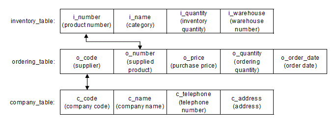
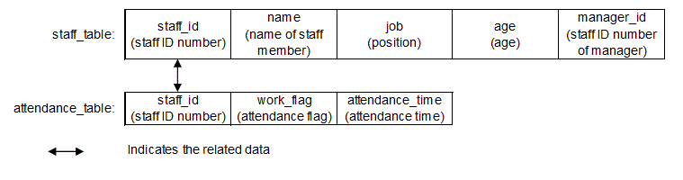

Chapter 1	Pre-Migration Configuration
----

This chapter explains the environment settings that must be configured before migration of an Oracle database.

**Note**

----

 - In this migration guide, the migration source Oracle database and the migration target PostgreSQL are targeted to be the versions listed below.
     - Oracle Database 12c
     - PostgreSQL 9.5
 - After migration, verify operation and confirm that the data was migrated successfully by checking if the intended result is obtained.

----

### 1.1 Setting the Server Parameter

This section explains the server parameter required for matching the behavior of PostgreSQL with the behavior of the Oracle database. 
Set the parameter in postgresql.conf so that the database always operates in the same way from all clients.

The following table shows the server parameter explained here.

|Server parameter|Description|
|:---|:---|
|search_path|Specifies the sequence in which schemas are searched.|

**Note**

----

 - The server parameter setting does not need to be changed. Change it only as required.
 - The explanations in Chapter 2 and following assume that the server parameter has been set.

----

#### 1.1.1 search_path

Functions added by orafce, which provides features for Oracle database compatibility, are defined as user-defined functions in the "public" schema that is created by default when a database cluster is created. 
This enables all users to be able to use these functions without having to configure any particular settings. 
Therefore, when using the search_path parameter to specify a schema search path, you must include "public".

Some data types and functions added by orafce are implemented with different external specifications in PostgreSQL and orafce. 
By default, the PostgreSQL external specifications have priority.

To implement these data types and functions in line with the orafce external specifications, specify "oracle" and "pg_catalog" in the search_path parameter of postgresql.conf. 
You must place "oracle" before "pg_catalog".

 - Before (default)

~~~
search_path = '"$user", public'
~~~

 - After

~~~
search_path = '"$user", public, oracle, pg_catalog'
~~~

**See**

----

Refer to Orafce Docmentation for information on features implemented with different external specifications in PostgreSQL and orafce.

----

### 1.2 Example Databases
This section uses the examples of an inventory management database for a particular retail store, and a staff management database for a particular company. 
The explanations of data operation provided in this manual are based on these example databases.

#### 1.2.1 Inventory Management Database
##### 1.2.1.1 Contents of Database Definitions
This database manages inventory in a retail store. 
It consists of the following three tables:

 - inventory_table
     - This table contains information on the products being handled and their inventory quantities.

 - ordering_table
     - This table contains information on the products supplied by each supplier, their ordering quantities, and their purchase prices.

 - company_table
     - This table contains the company name, telephone number, and address of each supply company.

**inventory_table**

The inventory table consists of the following four columns:

 - i_number (product number)
     - Code assigned to the product
 - i_name (category)
     - Category of the product
 - i_quantity (inventory quantity)
     - Inventory quantity of the product
 - i_warehouse (warehouse number)
      - Code of the warehouse where the product is stored

The contents of the inventory table are shown in "inventory_table".

 - ordering_table (ordering table)
     - The ordering table consists of the following five columns:
 - o_code (supplier)
     - Company code of the supplier
 - o_number (supplied product)
     - Code assigned to the product
 - o_price (purchase price)
     - Purchase price of the product
 - o_quantity (ordering quantity)
     - Number of products ordered
 - o_order_date (order date)
     - Product order date

The contents of the ordering table are shown in "ordering_table".

 - company_table (company table)
     - The company table consists of the following four columns:
 - c_code (company code)
     - Code assigned to the company
 - c_name (company name)
     - Name of the company
 - c_telephone (telephone number)
     - Telephone number of the company
 - c_address (address)
     - Address of the company

The contents of the company table are shown in "company_table".

Where the table names and column names described above are used in this guide, such as in example SQL statements, unless otherwise stated, the tables and columns listed in "Contents of the inventory management database" are specified. Note that the data shown in this table is fictitious.

**Contents of the inventory management database**

a)	inventory_table

|	i_number (product number)	|	i_name (category)	|	i_quantity (inventory quantity)	|	i_warehouse (warehouse number)	|
|	:---:	|	:---	|	:---:	|	:---:	
|SMALLINT PRIMARY KEY|VARCHAR(20) NOT NULL|INTEGER	|SMALLINT	|
|	110	|	television	|	85	|	2	|
|	111	|	television	|	90	|	2	|
|	123	|	refrigerator	|	60	|	1	|
|	124	|	refrigerator	|	75	|	1	|
|	140	|	cd player	|	120	|	2	|
|	212	|	television	|	0	|	2	|
|	215	|	video	|	5	|	2	|
|	226	|	refrigerator	|	8	|	1	|
|	227	|	refrigerator	|	15	|	1	|
|	240	|	cd player	|	25	|	2	|
|	243	|	cd player	|	14	|	2	|
|	351	|	cd	|	2500	|	2	|

b)	ordering_table

|	o_code (supplier)	|	o_number (supplied product)	|	o_price (purchase price)	|	o_quantity (ordering quantity)	|	o_order_date (order date)	|
|	:---:	|	:---:	|	:---:	|	:---:	|	:---:	|
|	SMALLINT NOT NULL	|	SMALLINT NOT NULL	|	INTEGER	|	SMALLINT	|	DATE	|
|	61	|	123	|	48000	|	60	|	42557	|
|	61	|	124	|	64000	|	40	|	42557	|
|	61	|	140	|	8000	|	80	|	42557	|
|	61	|	215	|	240000	|	10	|	42557	|
|	61	|	240	|	80000	|	20	|	42557	|
|	62	|	110	|	37500	|	120	|	42557	|
|	62	|	226	|	112500	|	20	|	42557	|
|	62	|	351	|	375	|	800	|	42557	|
|	63	|	111	|	57400	|	80	|	42557	|
|	63	|	212	|	205000	|	30	|	42557	|
|	63	|	215	|	246000	|	10	|	42557	|
|	71	|	140	|	7800	|	50	|	42557	|
|	71	|	351	|	390	|	600	|	42557	|
|	72	|	140	|	7000	|	70	|	42557	|
|	72	|	215	|	210000	|	10	|	42557	|
|	72	|	226	|	105000	|	20	|	42557	|
|	72	|	243	|	84000	|	10	|	42557	|
|	72	|	351	|	350	|	1000	|	42557	|
|	74	|	110	|	39000	|	120	|	42557	|
|	74	|	111	|	54000	|	120	|	42557	|
|	74	|	226	|	117000	|	20	|	42557	|
|	74	|	227	|	140400	|	10	|	42557	|
|	74	|	351	|	390	|	700	|	42557	|

c)	company_table

|	c_code (company code)	|	c_name (company name)	|	c_telephone (telephone number)	|	c_address (address) |
|	:---:	|	:---	|	:---:	|	:---|
|	SMALLINT NOT NULL	|	VARCHAR(20) NOT NULL	|	VARCHAR(12)	|	VARCHAR(50)|
|	61	|	Adam Electric	|	111-777-4444	|	7-8-9, Shin-Kamata, Oda Ward, Tokyo|
|	62	|	Idea Corporation	|	222-888-5555	|	1-2-3, Asahi Ward, Obama City, Kanagawa|
|	63	|	Fullmoon Industry	|	333-999-6666	|	1-1-1, Osaki, Urawa Town, Saitama|
|	71	|	Stream Electric	|	444-111-7777	|	4-5-6, Akasakadai, Sakaida City, Osaka|
|	72	|	Tornado Industry	|	555-222-8888	|	2-3-7, Higashi-Yodogawa, Nada Town, Osaka|
|	74	|	First Corporation	|	666-333-9999	|	4-16-16, Naka City, Kyoto|

##### 1.2.1.2 Relationship Between the Tables
"Relationship between the tables" shows how the tables are related with one another.
The inventory table and the ordering table are related by means of the product number and the supplied product.
The ordering table and the company table are related by means of the supplier and the company code. For example, the product identified by the product number "123" in the inventory table has the category "refrigerator" and the inventory quantity "60", and is stored in the warehouse identified by the code "1".
Then, the row containing the supplied product "123" in the ordering table shows that the purchase price of the product is "48000" and the ordering quantity is ""60".
Furthermore, the company code of the supplier can be confirmed as "61", and the row containing the company code "61" in the company table shows the name, telephone number, and address of the company that supplies the product.

**Relationship between the tables**
 

##### 1.2.1.3 Example Database Definitions

The following example shows table definitions for the inventory management database.

~~~
CREATE TABLE inventory_table (
i_number        SMALLINT PRIMARY KEY,
i_name          VARCHAR(20) NOT NULL,
i_quantity      INTEGER,
i_warehouse     SMALLINT
);

CREATE TABLE ordering_table (
o_code          SMALLINT NOT NULL,
o_number        SMALLINT NOT NULL,
o_price         INTEGER,
o_quantity      SMALLINT,
o_order_date    DATE
);

CREATE TABLE company_table (
c_code          SMALLINT NOT NULL,
c_name          VARCHAR(20) NOT NULL,
c_telephone     VARCHAR(12),
c_address       VARCHAR(50)
);

INSERT INTO inventory_table VALUES (110, 'television', 85, 2);
INSERT INTO inventory_table VALUES (111, 'television', 90, 2);
INSERT INTO inventory_table VALUES (123, 'refrigerator', 60, 1);
INSERT INTO inventory_table VALUES (124, 'refrigerator', 75, 1);
INSERT INTO inventory_table VALUES (140, 'cd player', 120, 2);
INSERT INTO inventory_table VALUES (212, 'television', 0, 2);
INSERT INTO inventory_table VALUES (215, 'video', 5, 2);
INSERT INTO inventory_table VALUES (226, 'refrigerator', 8, 1);
INSERT INTO inventory_table VALUES (227, 'refrigerator', 15, 1);
INSERT INTO inventory_table VALUES (240, 'cd player', 25, 2);
INSERT INTO inventory_table VALUES (243, 'cd player', 14, 2);
INSERT INTO inventory_table VALUES (351, 'cd', 2500, 2);

INSERT INTO ordering_table VALUES (61, 123, 48000, 60, DATE'2016-07-06');
INSERT INTO ordering_table VALUES (61, 124, 64000, 40, DATE'2016-07-06');
INSERT INTO ordering_table VALUES (61, 140, 8000, 80, DATE'2016-07-06');
INSERT INTO ordering_table VALUES (61, 215, 240000, 10, DATE'2016-07-06');
INSERT INTO ordering_table VALUES (61, 240, 80000, 20, DATE'2016-07-06');
INSERT INTO ordering_table VALUES (62, 110, 37500, 120, DATE'2016-07-06');
INSERT INTO ordering_table VALUES (62, 226, 112500, 20, DATE'2016-07-06');
INSERT INTO ordering_table VALUES (62, 351, 375, 800, DATE'2016-07-06');
INSERT INTO ordering_table VALUES (63, 111, 57400, 80, DATE'2016-07-06');
INSERT INTO ordering_table VALUES (63, 212, 205000, 30, DATE'2016-07-06');
INSERT INTO ordering_table VALUES (63, 215, 246000, 10, DATE'2016-07-06');
INSERT INTO ordering_table VALUES (71, 140, 7800, 50, DATE'2016-07-06');
INSERT INTO ordering_table VALUES (71, 351, 390, 600, DATE'2016-07-06');
INSERT INTO ordering_table VALUES (72, 140, 7000, 70, DATE'2016-07-06');
INSERT INTO ordering_table VALUES (72, 215, 210000, 10, DATE'2016-07-06');
INSERT INTO ordering_table VALUES (72, 226, 105000, 20, DATE'2016-07-06');
INSERT INTO ordering_table VALUES (72, 243, 84000, 10, DATE'2016-07-06');
INSERT INTO ordering_table VALUES (72, 351, 350, 1000, DATE'2016-07-06');
INSERT INTO ordering_table VALUES (74, 110, 39000, 120, DATE'2016-07-06');
INSERT INTO ordering_table VALUES (74, 111, 54000, 120, DATE'2016-07-06');
INSERT INTO ordering_table VALUES (74, 226, 117000, 20, DATE'2016-07-06');
INSERT INTO ordering_table VALUES (74, 227, 140400, 10, DATE'2016-07-06');
INSERT INTO ordering_table VALUES (74, 351, 390, 700, DATE'2016-07-06');

INSERT INTO company_table
VALUES (61, 'Adam Electric', '111-777-4444', '7-8-9, Shin-Kamata, Oda Ward, Tokyo');
INSERT INTO company_table
VALUES (62, 'Idea Corporation', '222-888-5555', '1-2-3, Asahi Ward, Obama City, Kanagawa');
INSERT INTO company_table
VALUES (63, 'Fullmoon Industry', '333-999-6666', '1-1-1, Osaki, Urawa Town, Saitama');
INSERT INTO company_table
VALUES (71, 'Stream Electric', '444-111-7777', '4-5-6, Akasakadai, Sakaida City, Osaka');
INSERT INTO company_table
VALUES (72, 'Tornado Industry', '555-222-8888', '2-3-7, Higashi-Yodogawa, Nada Town, Osaka');
INSERT INTO company_table
VALUES (74, 'First Corporation', '666-333-9999', '4-16-16, Naka City, Kyoto');
~~~

#### 1.2.2 Staff Management Database

##### 1.2.2.1 Contents of Database Definitions

This database manages the staff of the company. It consists of the following two tables:

 - staff_table (staff table)
     - This table contains the name, position, age, and manager of each staff member.
 - attendance_table (attendance management table)
     - This table contains the attendance time of each staff member.

**staff_table**

The staff table consists of the following five columns:

 - staff_id (staff identification number)
     - Code assigned to the staff member
 - name (name of the staff member)
     - Name of the staff member
 - job (position)
     - Position title of the staff member
 - age (age)
     - Age of the staff member
 - manager_id (staff identification number of manager)
     - Code assigned to the manager of the staff member

The contents of the staff table are shown in "staff_table".

**attendance_table**

The attendance management table consists of the following three columns:

 - staff_id (staff identification number)
     - Code assigned to the staff member
 - work_flag (attendance flag)
     - Flag indicating whether the staff member is present or absent
 - attendance_time (attendance time)
     - Work starting and ending times of the staff member

The contents of the attendance management table are shown in "attendance_table".

Where the table names and column names described above are used in this guide, such as in example SQL statements, unless otherwise stated, the tables and columns listed in "Contents of the staff management database" are specified. Note that the data shown in this table is fictitious.

**Contents of the staff management database**

a)	staff_table

|	staff_id (staff ID number)	|	name (name of the staff member)	|	job (position)	|	age (age)	|	manager_id (staff ID number of manager)	|
|:---:|:---|:---|:---:|:---:|
|CHAR(4)|VARCHAR(20)|VARCHAR(30)|INTEGER|CHAR(4)|
|	1001	|	tokyo taro	|	president	|	68	|\<NULL>|
|	2001	|	oosaka jiro	|	sales manager	|	48	|	1001 	|
|	3001	|	hyogo akihiko	|	sales member	|	28	|	2001	|
|	3002	|	mie megumi	|	sales member	|	31	|	2001	|
|	3003	|	hirosima taro	|	sales member	|	36	|	2001	|
|	3004	|	nagano motoko	|	sales member	|	40	|	2001	|
|	3005	|	akita taro	|	sales member	|	25	|	2001	|
|	2002	|	hukuoka saburo	|	accounting manager	|	52	|	1001	|
|	4001	|	nagasaki rokuro	|	accounting member	|	39	|	2002	|
|	2003	|	kyoto hanako	|	general affairs manager	|	43	|	1001	|
|	5001	|	okayama reiko	|	general affairs member	|	33	|	2003	|
|	5002	|	kagawa shiro	|	general affairs member	|	27	|	2003	|
|	5003	|	okinawa takao	|	general affairs member	|	30	|	2003	|
|	5004	|	miyagi kenta	|	\<NULL\>	|	23	|	2003	|
|	5005	|	aichi yui	|	''(null)	|	23	|	2003	|

b)	attendance_table

|	staff_id (staff ID number)	|	work_flag (attendance flag)	|	attendance_time (attendance time)	|
|	:---	|	:---	|	:---	|
|	CHAR(4)	|	CHAR(1)	|	TIMESTAMP WITH TIME ZONE	|
|	1001	|	i	|	2016-07-06 08:00:00+09	|
|	3001	|	i	|	2016-07-06 08:30:00+09	|
|	1001	|	o	|	2016-07-06 17:30:00+09	|
|	3001	|	o	|	2016-07-06 18:00:00+09	|

##### 1.2.2.2 Relationship Between the Tables
"Relationship between the tables" shows how the tables are related with one another. The staff table and the attendance management table are related by means of the staff identification number.

**Relationship between the tables**

 
##### 1.2.2.3 Example Database Definitions
The following example shows table definitions for the staff management database.

~~~
CREATE TABLE staff_table (
staff_id        CHAR(4),
name            VARCHAR(20),
job             VARCHAR(30),
age             INTEGER,
manager_id      CHAR(4)
);

CREATE TABLE attendance_table (
staff_id        CHAR(4),
work_flag       CHAR(1),
attendance_time TIMESTAMP WITH TIME ZONE
);

INSERT INTO staff_table VALUES ('1001', 'tokyo taro', 'president', 68, NULL);
INSERT INTO staff_table VALUES ('2001', 'oosaka jiro', 'sales manager', 48, '1001');
INSERT INTO staff_table VALUES ('3001', 'hyogo akihiko', 'sales member', 28, '2001');
INSERT INTO staff_table VALUES ('3002', 'mie megumi', 'sales member', 31, '2001');
INSERT INTO staff_table VALUES ('3003', 'hirosima taro', 'sales member', 36, '2001');
INSERT INTO staff_table VALUES ('3004', 'nagano motoko', 'sales member', 40, '2001');
INSERT INTO staff_table VALUES ('3005', 'akita taro', 'sales member', 25, '2001');
INSERT INTO staff_table VALUES ('2002', 'hukuoka saburo', 'accounting manager', 52, '1001');
INSERT INTO staff_table VALUES ('4001', 'nagasaki rokuro', 'accounting member', 39, '2002');
INSERT INTO staff_table VALUES ('2003', 'kyoto hanako', 'general affairs manager', 43, '1001');
INSERT INTO staff_table VALUES ('5001', 'okayama reiko', 'general affairs member', 33, '2003');
INSERT INTO staff_table VALUES ('5002', 'kagawa shiro', 'general affairs member', 27, '2003');
INSERT INTO staff_table VALUES ('5003', 'okinawa takao', 'general affairs member', 30, '2003');
INSERT INTO staff_table VALUES ('5004', 'miyagi kenta', NULL, 23, '2003');
INSERT INTO staff_table VALUES ('5005', 'aichi yui', '', 23, '2003');

INSERT INTO attendance_table VALUES ('1001', 'i', TIMESTAMP WITH TIME ZONE'2016-07-06 08:00:00+09:00');
INSERT INTO attendance_table VALUES ('3001', 'i', TIMESTAMP WITH TIME ZONE'2016-07-06 08:30:00+09:00');
INSERT INTO attendance_table VALUES ('1001', 'o', TIMESTAMP WITH TIME ZONE'2016-07-06 17:30:00+09:00');
INSERT INTO attendance_table VALUES ('3001', 'o', TIMESTAMP WITH TIME ZONE'2016-07-06 18:00:00+09:00');
~~~