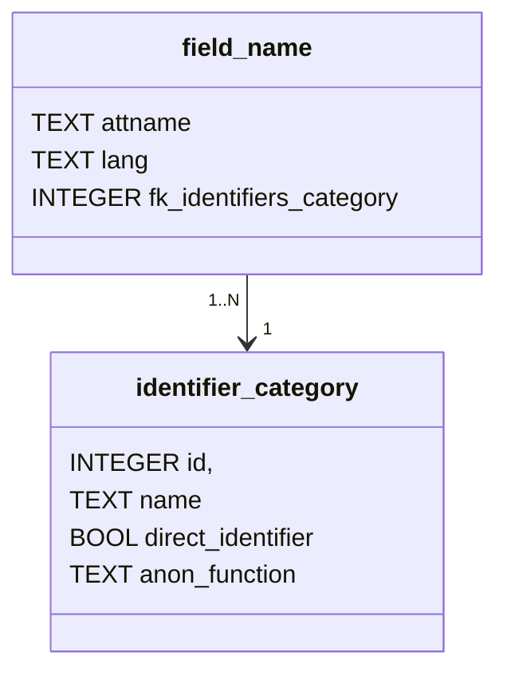

```mermaid
classDiagram

  class identifier_category{
        INTEGER id,
        TEXT name
        BOOL direct_identifier
        TEXT anon_function
  }

  class field_name{
        TEXT attname
        TEXT lang
        INTEGER fk_identifiers_category
  }

  field_name "1..N" --> "1" identifier_category
```
