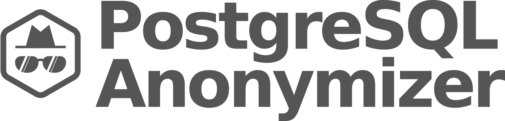

# Welcome to Paul's Boutique !

This is a 4 hours workshop that demonstrates various anonymization
techniques using the [PostgreSQL Anonymizer] extension.

[PostgreSQL Anonymizer]: https://labs.dalibo.com/postgresql_anonymizer

## The Story


Paul's boutique has a lot of customers. Paul asks his friend Pierre, a
Data Scientist, to make some statistics about his clients : average age,
etc...

Pierre wants a direct access to the database in order to write SQL
queries.

----


Jack is an employee of Paul. He's in charge of relationship with the
various suppliers of the shop.

Paul respects his suppliers privacy. He needs to hide the personnal
information to Pierre, but Jack needs read and write access the real
data.


## Objectives

Using the simple example above, we will learn:

-   How to write masking rules
-   The difference between static and dynamic masking
-   Implementing advanced masking techniques

----

## About PostgreSQL Anonymizer



------------------------------------------------------------------------

`postgresql_anonymizer` is an extension to mask or replace [personally
identifiable
information](https://en.wikipedia.org/wiki/Personally_identifiable_information)
(PII) or commercially sensitive data from a PostgreSQL database.

------------------------------------------------------------------------

The project has a **declarative approach** of anonymization. This means
you can [declare the masking rules]
using the PostgreSQL Data Definition Language (DDL) and specify your
anonymization strategy inside the table definition itself.

------------------------------------------------------------------------

Once the maskings rules are defined, you can access the anonymized data
in 4 different ways:

* [Anonymous Dumps] : Simply export the masked data into an SQL file
* [Static Masking] : Remove the PII according to the rules
* [Dynamic Masking] : Hide PII only for the masked users
* [Generalization] : Create "blurred views" of the original data


[personally identifiable information]: https://en.wikipedia.org/wiki/Personally_identifiable_information
[declare the masking rules]: https://postgresql-anonymizer.readthedocs.io/en/stable/declare_masking_rules

[Anonymous Dumps]: https://postgresql-anonymizer.readthedocs.io/en/stable/anonymous_dumps
[Static Masking]: https://postgresql-anonymizer.readthedocs.io/en/stable/static_masking
[Dynamic Masking]: https://postgresql-anonymizer.readthedocs.io/en/stable/dynamic_masking
[Masking Functions]: https://postgresql-anonymizer.readthedocs.io/en/stable/masking_functions
[Generalization]: https://postgresql-anonymizer.readthedocs.io/en/stable/generalization
[detection]: https://postgresql-anonymizer.readthedocs.io/en/stable/detection


## About GDPR

This presentation **does not** go into the details of the GPDR act and the
general concepts of anonymization.

For more information about it, please refer to the talk below:

-   [Anonymisation, Au-delà du RGPD](https://www.youtube.com/watch?v=KGSlp4UygdU) (Video / French)
-   [Anonymization, Beyond GDPR](https://public.dalibo.com/exports/conferences/_archives/_2019/20191016_anonymisation_beyond_GDPR/anonymisation_beyond_gdpr.pdf)
    (PDF / english)


## Requirements

In order to make this workshop, you will need:

-   A Linux VM ( preferably `Debian 11 bullseye` or `Ubuntu 22.04`)
-   A PostgreSQL instance ( preferably `PostgreSQL 14` )
-   The PostgreSQL Anonymizer (anon) extension, installed and
    initialized by a superuser
-   A database named "boutique" owned by a **superuser** called "paul"
-   A role "pierre" and a role "jack", both allowed to connect to
    the database "boutique"

------------------------------------------------------------------------

::: tip

A simple way to deploy a workshop environment is to install [Docker Desktop]
and download the image below:

:::

``` bash
docker pull registry.gitlab.com/dalibo/postgresql_anonymizer:stable
```

[Docker Desktop]: https://www.docker.com/products/docker-desktop/


----

::: tip

Check out the [INSTALL section](https://postgresql-anonymizer.readthedocs.io/en/stable/INSTALL)
in the [documentation](https://postgresql-anonymizer.readthedocs.io/en/stable/)
to learn how to install the extension in your PostgreSQL instance.

:::

----

## The Roles

We will with 3 differents users:

``` { .run-postgres user=postgres dbname=postgres show_result=false }
CREATE ROLE paul LOGIN SUPERUSER PASSWORD 'CHANGEME';
CREATE ROLE pierre LOGIN PASSWORD 'CHANGEME';
CREATE ROLE jack LOGIN PASSWORD 'CHANGEME';
```

---

::: tip

Unless stated otherwise, all commands must be executed with the role
`paul`.

:::

---

::: Tip
Setup a `.pgpass` file to simplify the connections !
:::

```console
cat > ~/.pgpass << EOL
*:*:boutique:paul:CHANGEME
*:*:boutique:pierre:CHANGEME
*:*:boutique:jack:CHANGEME
EOL
chmod 0600 ~/.pgpass
```


## The Sample database

We will work on a database called "boutique":

``` { .run-postgres user=postgres dbname=postgres }
CREATE DATABASE boutique OWNER paul;
```

We need to activate the `anon` library inside that database:

``` { .run-postgres user=postgres dbname=postgres }
ALTER DATABASE boutique
  SET session_preload_libraries = 'anon';
```


## Authors

This workshop is a collective work from Damien Clochard, Be Hai Tran,
Florent Jardin, Frédéric Yhuel.


## License

This document is distributed under the PostgreSQL license.

The source is available at

<https://gitlab.com/dalibo/postgresql_anonymizer/-/tree/master/docs/how-to>


## Credits

-   Cover photo by Alex Conchillos from Pexels (CC Zero)
-   "Paul's Boutique" is the second studio album by American hip hop
    group Beastie Boys, released on July 25, 1989 by Capitol Records
