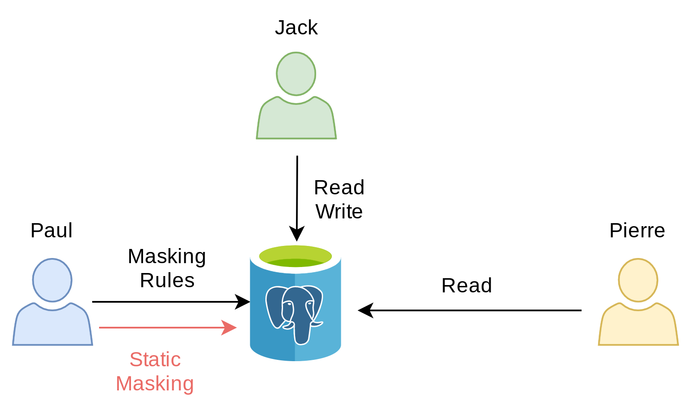

# 1 - Static Masking

> Static Masking is the simplest way to hide personal information! This
> idea is simply to destroy the original data or replace it with an
> artificial one.

## The story

Over the years, Paul has collected data about his customers and their
purchases in a simple database. He recently installed a brand new sales
application and the old database is now obsolete. He wants to save it
and he would like to remove all personal information before archiving
it.

## How it works



## Learning Objective

In this section, we will learn:

-   How to write simple masking rules
-   The advantage and limitations of static masking
-   The concept of "Singling Out" a person


## The "customer" table


``` { .run-postgres  parse_query=False }
DROP TABLE IF EXISTS customer CASCADE;

DROP TABLE IF EXISTS payout CASCADE;

CREATE TABLE customer (
    id SERIAL PRIMARY KEY,
    firstname TEXT,
    lastname TEXT,
    phone TEXT,
    birth DATE,
    postcode TEXT
);
```

Insert a few persons:

``` { .run-postgres  }
INSERT INTO customer
VALUES
(107,'Sarah','Conor','060-911-0911', '1965-10-10', '90016'),
(258,'Luke', 'Skywalker', NULL, '1951-09-25', '90120'),
(341,'Don', 'Draper','347-515-3423', '1926-06-01', '04520')
;
```

``` { .run-postgres  }
SELECT * FROM customer;
```

## The "payout" table

Sales are tracked in a simple table:

``` { .run-postgres  parse_query=False  }
CREATE TABLE payout (
    id SERIAL PRIMARY KEY,
    fk_customer_id INT REFERENCES customer(id),
    order_date DATE,
    payment_date DATE,
    amount INT
);
```

Let\'s add some orders:

``` { .run-postgres  }
INSERT INTO payout
VALUES
(1,107,'2021-10-01','2021-10-01', '7'),
(2,258,'2021-10-02','2021-10-03', '20'),
(3,341,'2021-10-02','2021-10-02', '543'),
(4,258,'2021-10-05','2021-10-05', '12'),
(5,258,'2021-10-06','2021-10-06', '92')
;
```

## Activate the extension

``` { .run-postgres  }
CREATE EXTENSION IF NOT EXISTS anon CASCADE;

SELECT anon.init();

SELECT setseed(0);
```

## Declare the masking rules

Paul wants to hide the last name and the phone numbers of his clients.
He will use the `fake_last_name()` and `partial()` functions for that:

``` { .run-postgres  }
SECURITY LABEL FOR anon ON COLUMN customer.lastname
IS 'MASKED WITH FUNCTION anon.fake_last_name()';

SECURITY LABEL FOR anon ON COLUMN customer.phone
IS 'MASKED WITH FUNCTION anon.partial(phone,2,$$X-XXX-XX$$,2)';
```

## Apply the rules permanently

``` { .run-postgres  }
SELECT anon.anonymize_table('customer');
```

``` { .run-postgres  }
SELECT id, firstname, lastname, phone
FROM customer;
```

------------------------------------------------------------------------

> This is called `Static Masking` because the **real data has been
> permanently replaced**. We\'ll see later how we can use dynamic
> anonymization or anonymous exports.

## Exercices

### E101 - Mask the client's first names

Declare a new masking rule and run the static anonymization function
again.

### E102 - Hide the last 3 digits of the postcode

Paul realizes that the postcode gives a clear indication of where his
customers live. However he would like to have statistics based on their
\"postcode area\".

**Add a new masking rule to replace the last 3 digits by 'x'.**

### E103 - Count how many clients live in each postcode area?

Aggregate the customers based on their anonymized postcode.

### E104 - Keep only the year of each birth date

Paul wants age-based statistic. But he also wants to hide the real birth
date of the customers.

Replace all the birth dates by January 1rst, while keeping the real
year.

::: tip

HINT: You can use the
[make_date](https://www.postgresql.org/docs/current/functions-datetime.html#FUNCTIONS-DATETIME-TABLE)
function !

:::

### E105 - Singling out a customer

Even if the \"customer\" is properly anonymized, we can still isolate a
given individual based on data stored outside of the table. For
instance, we can identify the best client of Paul\'s boutique with a
query like this:

``` { .run-postgres  }
WITH best_client AS (
    SELECT SUM(amount), fk_customer_id
    FROM payout
    GROUP BY fk_customer_id
    ORDER BY 1 DESC
    LIMIT 1
)
SELECT c.*
FROM customer c
JOIN best_client b ON (c.id = b.fk_customer_id)
```

::: important

This is called **[Singling Out](https://www.pnas.org/content/117/15/8344) a person.**

:::

We need to anonymize even further by removing the link between a person
and its company. In the \"order\" table, this link is materialized by a
foreign key on the field \"fk_company_id\". However we can\'t remove
values from this column or insert fake identifiers because if would
break the foreign key constraint.

------------------------------------------------------------------------

How can we separate the customers from their payouts while respecting
the integrity of the data?

Find a function that will shuffle the column \"fk_company_id\" of the
\"payout\" table

::: tip

HINT: Check out the [static masking](https://postgresql-anonymizer.readthedocs.io/en/stable/static_masking#shuffling)
section of the
[documentation](https://postgresql-anonymizer.readthedocs.io/en/stable/)
:::

## Solutions

### S101

``` { .run-postgres  }
SECURITY LABEL FOR anon ON COLUMN customer.firstname
IS 'MASKED WITH FUNCTION anon.fake_first_name()';

SELECT anon.anonymize_table('customer');

SELECT id, firstname, lastname
FROM customer;
```

### S102

``` { .run-postgres  }
SECURITY LABEL FOR anon ON COLUMN customer.postcode
IS 'MASKED WITH FUNCTION anon.partial(postcode,2,$$xxx$$,0)';

SELECT anon.anonymize_table('customer');

SELECT id, firstname, lastname, postcode
FROM customer;
```

### S103

``` { .run-postgres  }
SELECT postcode, COUNT(id)
FROM customer
GROUP BY postcode;
```

### S104

``` { .run-postgres  }
SECURITY LABEL FOR anon ON COLUMN customer.birth
IS 'MASKED WITH FUNCTION make_date(EXTRACT(YEAR FROM birth)::INT,1,1)';

SELECT anon.anonymize_table('customer');

SELECT id, firstname, lastname, birth
FROM customer;
```

### S105

Let\'s mix up the values of the fk_customer_id:

``` { .run-postgres  }
SELECT anon.shuffle_column('payout','fk_customer_id','id');
```

Now let\'s try to single out the best client again :

``` { .run-postgres  }
WITH best_client AS (
    SELECT SUM(amount), fk_customer_id
    FROM payout
    GROUP BY fk_customer_id
    ORDER BY 1 DESC
    LIMIT 1
)
SELECT c.*
FROM customer c
JOIN best_client b ON (c.id = b.fk_customer_id);
```

------------------------------------------------------------------------

**WARNING**

Note that the link between a `customer` and its `payout` is now
completely false. For instance, if a customer A had 2 payouts. One of
these payout may be linked to a customer B, while the second one is
linked to a customer C.

In other words, this shuffling method with respect the foreign key
constraint (aka the referential integrity) but it will break the data
integrity. For some use case, this may be a problem.

In this case, Pierre will not be able to produce a BI report with the
shuffle data, because the links between the customers and their payments
are fake.
