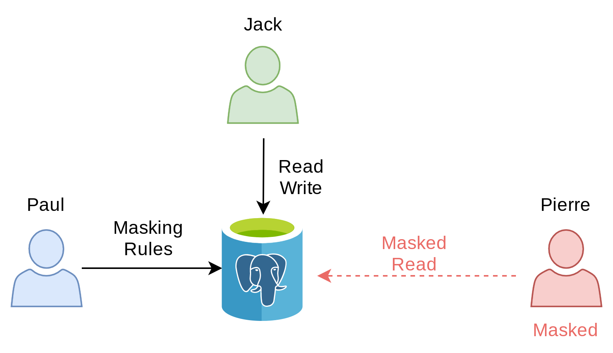

# 2- How to use Dynamic Masking

> With Dynamic Masking, the database owner can hide personnal data for
> some users, while other users are still allowed to read and write the
> authentic data.

## The Story

Paul has 2 employees:

-   Jack is operating the new sales application, he needs access to the
    real data. He is what the GPDR would call a **\"data processor\"**.
-   Pierre is a data analyst who runs statistic queries on the database.
    He should not have access to any personnal data.

## How it works



## Objectives

In this section, we will learn:

-   How to write simple masking rules
-   The advantage and limitations of dynamic masking
-   The concept of \"Linkability\" of a person

## The "company" table


``` { .run-postgres parse_query=False }

DROP TABLE IF EXISTS supplier CASCADE;

DROP TABLE IF EXISTS company CASCADE;

CREATE TABLE company (
    id SERIAL PRIMARY KEY,
    name TEXT,
    vat_id TEXT UNIQUE
);
```

``` run-postgres
INSERT INTO company
VALUES
(952,'Shadrach', 'FR62684255667'),
(194,E'Johnny\'s Shoe Store','CHE670945644'),
(346,'Capitol Records','GB663829617823')
;
```

``` run-postgres
SELECT * FROM company;
```

## The \"supplier\" table

``` { .run-postgres parse_query=False }
CREATE TABLE supplier (
    id SERIAL PRIMARY KEY,
    fk_company_id INT REFERENCES company(id),
    contact TEXT,
    phone TEXT,
    job_title TEXT
);
```

``` run-postgres
INSERT INTO supplier
VALUES
(299,194,'Johnny Ryall','597-500-569','CEO'),
(157,346,'George Clinton', '131-002-530','Sales manager')
;
```

``` run-postgres
SELECT * FROM supplier;
```

## Activate the extension

``` run-postgres
CREATE EXTENSION IF NOT EXISTS anon CASCADE;

SELECT anon.init();

SELECT setseed(0);
```

## Dynamic Masking

### Activate the masking engine

``` run-postgres
SELECT anon.start_dynamic_masking();
```

### Masking a role


``` run-postgres
SECURITY LABEL FOR anon ON ROLE pierre IS 'MASKED';

GRANT SELECT ON supplier TO pierre;
GRANT ALL ON SCHEMA public TO jack;
GRANT ALL ON ALL TABLES IN SCHEMA public TO jack;
```


------------------------------------------------------------------------

Now connect as Pierre and try to read the supplier table:

``` { .run-postgres user=pierre}
SELECT * FROM supplier;
```

For the moment, there is no masking rule so Pierre can see the original
data in each table.

## Masking the supplier names

Connect as Paul and define a masking rule on the supplier table:

``` run-postgres
SECURITY LABEL FOR  anon ON COLUMN supplier.contact
IS 'MASKED WITH VALUE $$CONFIDENTIAL$$';
```


------------------------------------------------------------------------

Now connect as Pierre and try to read the supplier table again:

``` { .run-postgres user=pierre}
SELECT * FROM supplier;
```

------------------------------------------------------------------------

Now connect as Jack and try to read the real data:

``` { .run-postgres user=jack }
SELECT * FROM supplier;
```

## Exercices

### E201 - Guess who is the CEO of \"Johnny\'s Shoe Store\"

Masking the supplier name is clearly not enough to provide anonymity.

**Connect as Pierre and write a simple SQL query that would reindentify
some suppliers based on their job and their company.**

Company names and job positions are available in many public datasets. A
simple search on Linkedin or Google, would give you the names of the top
executives of most companies..

> This is called **Linkability**: the ability to connect multiple
> records concerning the same data subject.

### E202 - Anonymize the companies

We need to anonymize the \"company\" table, too. Even if they don\'t
contain personal information, some fields can be used to **infer** the
identity of their employees\...

**Write 2 masking rules for the company table. The first one will
replace the \"name\" field with a fake name. The second will replace the
\"vat_id\" with a random sequence of 10 characters**

> HINT: Go to the
> [documentation](https://postgresql-anonymizer.readthedocs.io/en/stable/)
> and look at the [faking
> functions](https://postgresql-anonymizer.readthedocs.io/en/stable/masking_functions#faking)
> and [random
> functions](https://postgresql-anonymizer.readthedocs.io/en/stable/masking_functions#randomization)!

Connect as Pierre and check that he cannot view the real company info:

### E203 - Pseudonymize the company name

Because of dynamic masking, the fake values will be different everytime
Pierre tries to read the table.

Pierre would like to have always the same fake values for a given
company. **This is called pseudonymization.**

**Write a new masking rule over the \"vat_id\" field by generating 10
random characters using the md5() function.**

**Write a new masking rule over the \"name\" field by using a
[pseudonymizing
function](https://postgresql-anonymizer.readthedocs.io/en/stable/masking_functions#pseudonymization).**

## Solutions

### S201

``` { .run-postgres user=pierre }
SELECT s.id, s.contact, s.job_title, c.name
FROM supplier s
JOIN company c ON s.fk_company_id = c.id;
```


### S202

``` run-postgres
SECURITY LABEL FOR anon ON COLUMN company.name
IS 'MASKED WITH FUNCTION anon.fake_company()';

SECURITY LABEL FOR anon ON COLUMN company.vat_id
IS 'MASKED WITH FUNCTION anon.random_string(10)';
```

Now connect as Pierre and read the table again:

``` { .run-postgres user=pierre }
SELECT * FROM company;
```

Pierre will see different \"fake data\" everytime he reads the table:

``` { .run-postgres user=pierre }
SELECT * FROM company;
```

### S203

``` run-postgres
ALTER FUNCTION anon.pseudo_company SECURITY DEFINER;

SECURITY LABEL FOR  anon ON COLUMN company.name
IS 'MASKED WITH FUNCTION anon.pseudo_company(id)';
```

Connect as Pierre and read the table multiple times:

``` { .run-postgres user=pierre }
SELECT * FROM company;
```

``` { .run-postgres user=pierre }
SELECT * FROM company;
```
Now the fake company name is always the same.
