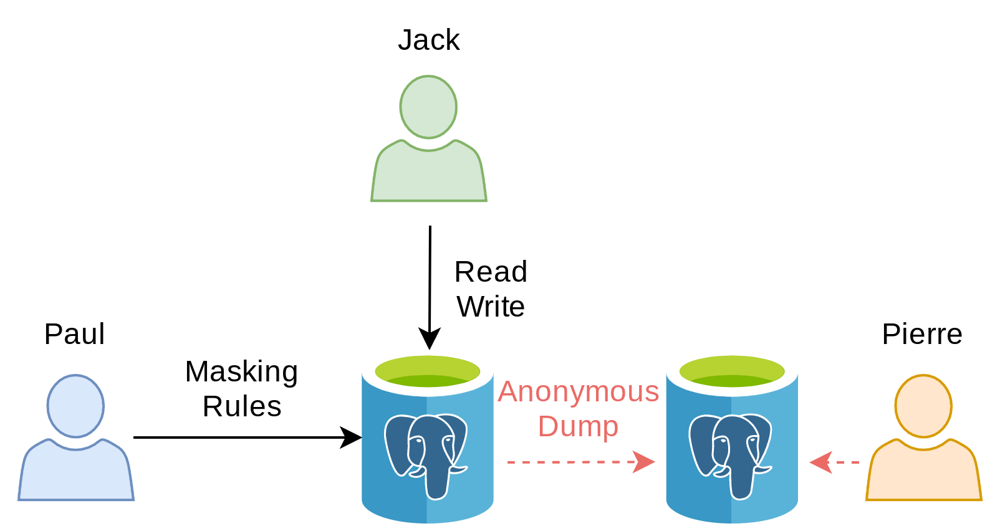

# 3- Anonymous Dumps

> In many situation, what we want is simply to export the anonymized
> data into another database (for testing or to produce statistics).
> This is what **pg_dump_anon** does!

## The Story

Paul has a website and a comment section where customers can express
their views.

He hired a web agency to develop a new design for his website. The
agency asked for a SQL export (dump) of the current website database.
Paul wants to \"clean\" the database export and remove any personnal
information contained in the comment section.

## How it works



## Learning Objective

-   Extract the anonymized data from the database
-   Write a custom masking function to handle a JSON field.

## Load the data

``` run-postgres
DROP TABLE IF EXISTS website_comment CASCADE;

CREATE TABLE website_comment (
  id SERIAL PRIMARY KEY,
  message JSONB
);
```

------------------------------------------------------------------------

```bash
curl -Ls https://dali.bo/website_comment -o /tmp/website_comment.tsv
head /tmp/website_comment.tsv
```

``` run-postgres
COPY website_comment
FROM '/tmp/website_comment.tsv'
```

---

``` run-postgres
SELECT
  message->'meta'->'name' AS name,
  message->'content' AS content
FROM website_comment
ORDER BY id ASC
```

## Activate the extension

``` run-postgres
CREATE EXTENSION IF NOT EXISTS anon CASCADE;
SELECT anon.init();
SELECT setseed(0);
```

## Masking a JSON column

The \"comment\" field is filled with personal information and the fact
the field does not have a standard schema makes our tasks harder.

**In general, unstructured data are difficult to mask**.

As we can see, web visitors can write any kind of information in the
comment section. Our best option is to remove this key entirely because
there\'s no way to extract personnal data properly.


------------------------------------------------------------------------

We can *clean* the comment column simply by removing the \"content\"
key!

``` run-postgres
SELECT message - ARRAY['content']
FROM website_comment
WHERE id=1;
```

------------------------------------------------------------------------

First let\'s create a dedicated schema and declare it as trusted. This
means the \"anon\" extension will accept the functions located in this
schema as valid masking functions. Only a superuser should be able to
add functions in this schema.


``` run-postgres
CREATE SCHEMA IF NOT EXISTS my_masks;

SECURITY LABEL FOR anon ON SCHEMA my_masks IS 'TRUSTED';
```


------------------------------------------------------------------------

Now we can write a function that remove the message content:

``` run-postgres
CREATE OR REPLACE FUNCTION my_masks.remove_content(j JSONB)
RETURNS JSONB
AS $func$
  SELECT j - ARRAY['content']
$func$
LANGUAGE SQL
;
```


------------------------------------------------------------------------

Let\'s try it!

``` run-postgres
SELECT my_masks.remove_content(message)
FROM website_comment
```


------------------------------------------------------------------------

And now we can use it in a masking rule:

``` run-postgres
SECURITY LABEL FOR anon ON COLUMN website_comment.message
IS 'MASKED WITH FUNCTION my_masks.remove_content(message)';
```

------------------------------------------------------------------------

Finally we can export an **anonymous dump** of the table with
`pg_dump_anon`:

``` bash
export PATH=$PATH:$(pg_config --bindir)
pg_dump_anon --help
```

``` bash
export PATH=$PATH:$(pg_config --bindir)
export PGHOST=localhost
export PGUSER=paul
pg_dump_anon boutique --table=website_comment > /tmp/dump.sql
```

## Exercices

### E301 - Dump the anonymized data into a new database

Create a database named \"boutique_anon\" and transfer the entire
database into it.

### E302 - Pseudonymize the meta fields of the comments

Pierre plans to extract general information from the metadata. For
instance, he wants to calculate the number of unique visitors based on
the different IP adresses. But an IP adress is an **indirect
identifier**, so Paul needs to anonymize this field while maintaining
the fact that some values appear multiple times.

Replace the `remove_content` function with a better one called
`clean_comment` that will:

-   Remove the content key
-   Replace the \"name\" value with a fake last name
-   Replace the \"ip_address\" value with its MD5 signature
-   Nullify the \"email\" key

> HINT: Look at the `jsonb_set()` and `jsonb_build_object()` functions

## Solutions

### S301

``` bash
export PATH=$PATH:$(pg_config --bindir)
export PGHOST=localhost
export PGUSER=paul
dropdb --if-exists boutique_anon
createdb boutique_anon --owner paul
pg_dump_anon boutique | psql --quiet boutique_anon
```

``` bash
export PGHOST=localhost
export PGUSER=paul
psql boutique_anon -c 'SELECT COUNT(*) FROM company'
```

### S302

```run-postgres
CREATE OR REPLACE FUNCTION my_masks.clean_comment(message JSONB)
RETURNS JSONB
VOLATILE
LANGUAGE SQL
AS $func$
SELECT
  jsonb_set(
    message,
    ARRAY['meta'],
    jsonb_build_object(
        'name',anon.fake_last_name(),
        'ip_address', md5((message->'meta'->'ip_addr')::TEXT),
        'email', NULL
    )
  ) - ARRAY['content'];
$func$;
```

``` run-postgres
SELECT my_masks.clean_comment(message)
FROM website_comment;
```

``` run-postgres
SECURITY LABEL FOR anon ON COLUMN website_comment.message
IS 'MASKED WITH FUNCTION my_masks.clean_comment(message)';
```
